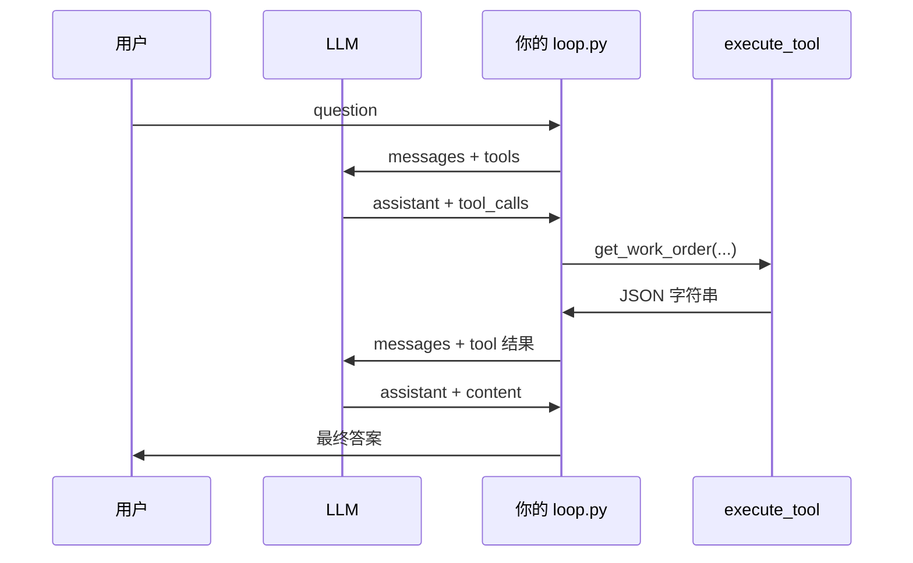

# Function Calling 详解 — 结合 SanyMES Agent 项目

> 本文档解答：LLM 怎么决定调不调工具、返回数据长什么样、messages 怎么拼、`tool_calls` 和 `tc.id` 是什么意思。  
> 示例代码来自本项目的 `tools.py`、`llm.py`、`loop.py`。

---

## 目录

1. [Function Calling 是什么](#1-function-calling-是什么)
2. [和阶段 1 的 Context Injection 有什么区别](#2-和阶段-1-的-context-injection-有什么区别)
3. [你发给 LLM 什么：tools 参数](#3-你发给-llm-什么tools-参数)
4. [LLM 怎么「判断」要不要调工具](#4-llm-怎么判断要不要调工具)
5. [LLM 返回的两种形态](#5-llm-返回的两种形态)
6. [message.tool_calls 长什么样](#6-messagetool_calls-长什么样)
7. [tc.id 是什么意思](#7-tcid-是什么意思)
8. [完整 messages 对话结构](#8-完整-messages-对话结构)
9. [你的代码里每一步在干什么](#9-你的代码里每一步在干什么)
10. [走一遍真实例子](#10-走一遍真实例子)
11. [常见误区与报错](#11-常见误区与报错)
12. [自测清单](#12-自测清单)

---

## 1. Function Calling 是什么

**Function Calling（也叫 Tool Use）**：你给 LLM 一份「可用工具清单」，LLM 在回答用户之前，可以**选择**先「调用」某个工具，由**你的代码**真正执行（查数据库、调 API 等），再把执行结果还给 LLM，LLM 最后组织成自然语言回答用户。

```
用户问题
   ↓
LLM（看到 tools 定义）→ 「我需要查 WO-001」→ 返回 tool_calls（不是最终答案）
   ↓
你的代码执行 get_work_order(order_no="WO-001") → 得到 JSON
   ↓
你把 JSON 作为 role=tool 的消息塞回对话
   ↓
LLM 再次推理 → 返回 content（给用户看的最终中文回答）
```

**关键理解：**

- LLM **不会**真的执行 Python 函数，它只会**生成「我想调哪个工具、参数是什么」的结构化文本**
- **你的 `execute_tool()`** 才是真正查库的地方
- 这是一个 **多轮对话**：第一轮可能要工具，第二轮才给答案

---

## 2. 和阶段 1 的 Context Injection 有什么区别

| | 阶段 1 `/ask` | 阶段 2 `/chat` |
|--|--------------|----------------|
| 谁决定查什么 | **你的 Python 代码**（`extract_order_no`） | **LLM** 根据 tools 描述决定 |
| 数据何时给 LLM | 调用 LLM **之前**就塞进 prompt | LLM **先要工具**，你再给结果 |
| 请求参数 | 只有 `messages` | `messages` + `tools` |
| LLM 返回 | 直接是 `content`（最终答案） | 可能是 `tool_calls`，也可能是 `content` |

阶段 1 相当于你替 LLM 做好了所有查询；阶段 2 是 LLM 自己点菜，厨房（你的代码）做菜。

---

## 3. 你发给 LLM 什么：tools 参数

调用 API 时除了 `messages`，还要传 `tools`（工具定义列表）。本项目在 `tools.py` 里：

```python
TOOLS = [
    {
        "type": "function",
        "function": {
            "name": "get_work_order",           # 工具名，execute_tool 靠它分发
            "description": "按工单号查询...",  # ★ LLM 靠这段决定何时用
            "parameters": {                     # JSON Schema，描述参数形状
                "type": "object",
                "properties": {
                    "order_no": {
                        "type": "string",
                        "description": "工单号，如 WO-20250706-001",
                    }
                },
                "required": ["order_no"],
            },
        },
    },
    # list_work_orders ...
]
```

对应 `llm.py` 的请求：

```python
response = client.chat.completions.create(
    model=model,
    messages=messages,
    tools=TOOLS,      # ← 工具菜单
    stream=False,
)
message = response.choices[0].message
```

**LLM 在推理时能「看到」的内容：**

- 全部 `messages`（system / user / assistant / tool 历史）
- 全部 `tools` 定义（name + description + parameters）
- **看不到**你的 Python 源码、`execute_tool` 实现、数据库

---

## 4. LLM 怎么「判断」要不要调工具

这不是 `if/else` 代码逻辑，而是 **模型根据文本语义做的概率预测**。

模型会综合考虑：

1. **用户问题** — 「WO-001 进度怎么样」→ 需要查具体工单  
2. **system prompt** — 你写了「需要数据时必须先调工具」  
3. **每个工具的 `description`** — 是否匹配当前意图  
4. **`parameters` 描述** — 能否从用户话里抽出参数（如工单号）

| 用户问题 | LLM 倾向 |
|---------|---------|
| `WO-20250706-001 进度怎么样？` | 调 `get_work_order` |
| `现在有哪些工单在生产？` | 调 `list_work_orders` |
| `你好` / `MES 是什么？` | 通常**不调工具**，直接 `content` 回答 |
| `今天天气怎么样？` | 不应编造工单；理想情况直接说不知道（取决于 prompt） |

**注意：**

- 不是 100% 可靠，可能该调不调、调错工具、参数 hallucinate  
- `description` 写得越清楚，准确率越高  
- 所以需要 `MAX_TURNS`、错误 JSON 处理、以及阶段 1 那种代码兜底（可选）

---

## 5. LLM 返回的两种形态

`response.choices[0].message` 是一个对象，核心两个字段：

| 字段 | 含义 |
|------|------|
| `message.content` | 给用户看的自然语言（**最终答案**时才有实质内容） |
| `message.tool_calls` | 模型「请求调用」的工具列表（**要查数据时**才有） |

### 形态 A：直接回答（不调工具）

```json
{
  "role": "assistant",
  "content": "MES 是制造执行系统，负责车间层面的生产执行……",
  "tool_calls": null
}
```

你的 `loop.py` 逻辑：

```python
if message.tool_calls:
    # 去执行工具……
else:
    return message.content   # ← 结束
```

### 形态 B：请求调工具（尚无最终答案）

```json
{
  "role": "assistant",
  "content": null,
  "tool_calls": [
    {
      "id": "call_abc123",
      "type": "function",
      "function": {
        "name": "get_work_order",
        "arguments": "{\"order_no\": \"WO-20250706-001\"}"
      }
    }
  ]
}
```

**重点：**

- 此时 `content` 往往是 `null` 或空字符串 — **还不是最终答案**
- 真正重要的是 `tool_calls` 数组
- `function.arguments` 是 **JSON 字符串**，不是 dict，要 `json.loads()`

---

## 6. message.tool_calls 长什么样

在 Python SDK 里（OpenAI 兼容接口）：

```python
message = response.choices[0].message

for tc in message.tool_calls:
    print(tc.id)                    # call_abc123
    print(tc.type)                  # function
    print(tc.function.name)         # get_work_order
    print(tc.function.arguments)    # '{"order_no": "WO-20250706-001"}'
```

结构树：

```
message
├── content: str | None
└── tool_calls: list | None
    └── [0] ChatCompletionMessageToolCall
        ├── id: "call_abc123"
        ├── type: "function"
        └── function
            ├── name: "get_work_order"
            └── arguments: '{"order_no": "WO-20250706-001"}'   ← 字符串！
```

一次响应里可以有 **多个** tool_calls（并行查多个工具），你的 loop 用 `for call in message.tool_calls` 逐个处理即可。

转成 API 要求的 dict 格式（你 `assistant_message_to_dict` 在做的事）：

```python
{
    "role": "assistant",
    "content": "",
    "tool_calls": [
        {
            "id": "call_abc123",
            "type": "function",
            "function": {
                "name": "get_work_order",
                "arguments": "{\"order_no\": \"WO-20250706-001\"}"
            }
        }
    ]
}
```

---

## 7. tc.id 是什么意思

`tc.id`（如 `call_abc123`）是 **这一次工具调用请求的唯一 ID**，由 API 生成。

**用途：把「assistant 发起的请求」和「tool 返回的结果」配对。**

下一轮你 append 的 tool 消息必须带同一个 id：

```python
{
    "role": "tool",
    "tool_call_id": "call_abc123",   # ← 必须和上面的 tc.id 一致
    "content": "{\"ok\": true, \"data\": {...}}"
}
```

类比：

```
assistant: 「请帮我查工单，单子编号是 call_abc123 这笔申请」
tool:      「call_abc123 的查询结果如下：{...}」
```

如果 `tool_call_id` 对不上，API 会报 `invalid messages` 一类错误。

**一个 assistant 消息里多个 tool_calls 时：** 每个 call 有各自的 `id`，你要为每个 id 各发一条 `role: tool` 消息。

---

## 8. 完整 messages 对话结构

Function calling 里 **4 种 role**（比阶段 1 多了 `tool`）：

| role | 谁产生 | 作用 |
|------|--------|------|
| `system` | 你 | 角色、规则 |
| `user` | 用户 / 你 | 用户问题 |
| `assistant` | LLM | 最终回答 **或** 带 `tool_calls` 的「工具请求」 |
| `tool` | **你的代码** | 工具执行结果，必须带 `tool_call_id` |

### 一次完整工具调用的 message 序列

```
① system:   你是 SanyMES 智能助手……
② user:     WO-20250706-001 进度怎么样？
③ assistant: tool_calls=[get_work_order(...)]     ← LLM 说要查
④ tool:     tool_call_id=call_xxx, content=JSON   ← 你执行后塞回
⑤ assistant: content="该工单当前生产中……"          ← LLM 最终回答
```

**规则（API 强制）：**

1. `tool` 消息必须紧跟在「包含对应 `tool_calls` 的 `assistant` 消息」之后（中间不能插别的 role）
2. 每个 `tool_call.id` 都要有一条对应的 `tool` 回复
3. 把 ③ 原样 append 进 history，再 append ④，再发起下一轮请求

### 用 mermaid 表示你的 loop



---

## 9. 你的代码里每一步在干什么

### `llm.py` — 发起请求

```python
def chat_with_tools(messages, *, model, tools):
    response = client.chat.completions.create(
        model=model,
        messages=messages,
        tools=tools,
    )
    return response.choices[0].message   # 返回整条 message，不要只取 .content
```

### `loop.py` — 分支判断

```python
message = chat_with_tools(messages, model=..., tools=TOOLS)

if message.tool_calls:
    # 路径 B：要工具
    messages.append(assistant_message_to_dict(message))  # ③

    for call in message.tool_calls:
        args = json.loads(call.function.arguments)
        result = execute_tool(call.function.name, args, db)
        messages.append({
            "role": "tool",
            "tool_call_id": call.id,
            "content": result,
        })  # ④
    continue   # 带着新 messages 再问 LLM

# 路径 A：最终答案
return message.content, tool_trace   # ⑤
```

### `tools.py` — 真正执行

```python
def execute_tool(name, arguments, db) -> str:
    if name == "get_work_order":
        result = tool_get_work_order(db, arguments["order_no"])
    ...
    return json.dumps(result, ensure_ascii=False)  # 必须是字符串
```

**回答你的具体问题：「是不是加一个 role=assistant 的 message？」**

- **不完全是。** 要加的是 **带 `tool_calls` 字段的 assistant 消息**（通常 `content` 为空）
- 然后加 **一条或多条 `role: tool` 的消息**（不是再加一个普通 assistant）
- 最后 **下一轮** LLM 才会返回「正常 assistant + content」作为最终答案

---

## 10. 走一遍真实例子

**用户：** `WO-20250706-001 进度怎么样？`

### 第 1 次请求 LLM

**发送 messages：**

```json
[
  {"role": "system", "content": "你是 SanyMES 智能助手……"},
  {"role": "user", "content": "WO-20250706-001 进度怎么样？"}
]
```

**LLM 返回（形态 B）：**

```python
message.content      # None 或 ""
message.tool_calls   # 长度 1
# tool_calls[0].function.name == "get_work_order"
# tool_calls[0].function.arguments == '{"order_no": "WO-20250706-001"}'
```

### 你的代码执行工具

```python
execute_tool("get_work_order", {"order_no": "WO-20250706-001"}, db)
# → '{"ok": true, "data": {"order_no": "WO-20250706-001", "status": "in_progress", ...}}'
```

### 第 2 次请求 LLM

**发送 messages（比上次多了 2 条）：**

```json
[
  {"role": "system", "content": "..."},
  {"role": "user", "content": "WO-20250706-001 进度怎么样？"},
  {
    "role": "assistant",
    "content": "",
    "tool_calls": [{
      "id": "call_abc123",
      "type": "function",
      "function": {
        "name": "get_work_order",
        "arguments": "{\"order_no\": \"WO-20250706-001\"}"
      }
    }]
  },
  {
    "role": "tool",
    "tool_call_id": "call_abc123",
    "content": "{\"ok\": true, \"data\": {\"status\": \"in_progress\", \"progress\": \"3/7\", ...}}"
  }
]
```

**LLM 返回（形态 A）：**

```python
message.content      # "该工单当前生产中，进度 3/7，当前在液压系统工位……"
message.tool_calls   # None
```

loop 结束，把 `content` 返回给前端。

---

## 11. 常见误区与报错

| 误区 | 正确理解 |
|------|---------|
| LLM 会直接执行 Python | 只返回「想调什么」；执行靠 `execute_tool` |
| `tool_calls` 时就有最终答案 | 那时只有工具请求，答案在下一轮 `content` |
| `arguments` 是 dict | 是 JSON **字符串**，要 `json.loads` |
| 只 append `role: tool` | 必须先 append 带 `tool_calls` 的 **assistant** |
| `tool_call_id` 随便写 | 必须等于对应 `tc.id` |
| 有 `yield` 的函数不执行体 | 与 function call 无关，但是 Python 坑；`chat_with_tools` 不要用 yield |
| `parameters` 写成数组 `[{...}]` | 必须是对象 `{type, properties, required}` |

**典型 API 报错：**

```
An assistant message with 'tool_calls' must be followed by tool messages responding to each tool_call_id
```

→ 漏了 `role: tool` 消息，或 `tool_call_id` 不匹配。

---

## 12. 自测清单

理解 function calling 后，你应该能口头回答：

- [ ] `tools` 参数和 `messages` 分别干什么？
- [ ] 什么时候 `message.tool_calls` 非空？
- [ ] `tc.id` 为什么必须有？
- [ ] 为什么 `execute_tool` 返回字符串而不是 dict？
- [ ] 一次工具调用，messages 最少增加几条？（2 条：assistant+tool_calls，tool result）
- [ ] 阶段 1 和阶段 2 谁决定查数据库？

**动手验证：**

```bash
cd backend
python -m app.agent.loop
```

看输出里 `工具链: [{'tool': 'get_work_order', ...}]` 和最终「答案」是否同时出现。

在 `loop.py` 里临时加：

```python
print(json.dumps(messages, ensure_ascii=False, indent=2))
```

观察第 1 次循环结束后的 messages 是否包含 `assistant(tool_calls)` + `tool` 两条。

---

## 附录：对照本项目文件

| 概念 | 文件 | 函数/变量 |
|------|------|-----------|
| 工具定义 | `app/agent/tools.py` | `TOOLS` |
| 工具执行 | `app/agent/tools.py` | `execute_tool()` |
| API 请求 | `app/agent/llm.py` | `chat_with_tools()` |
| Agent 循环 | `app/agent/loop.py` | `run_agent()` |
| assistant 转 dict | `app/agent/loop.py` | `assistant_message_to_dict()` |
| HTTP 入口 | `app/agent/router.py` | `POST /api/agent/chat` |

---

> 建议阅读顺序：本文档 → 打开 `loop.py` 对照第 9 节 → 运行 `python -m app.agent.loop` → 在 Swagger 调 `POST /api/agent/chat` 看 `tool_calls` 字段。
