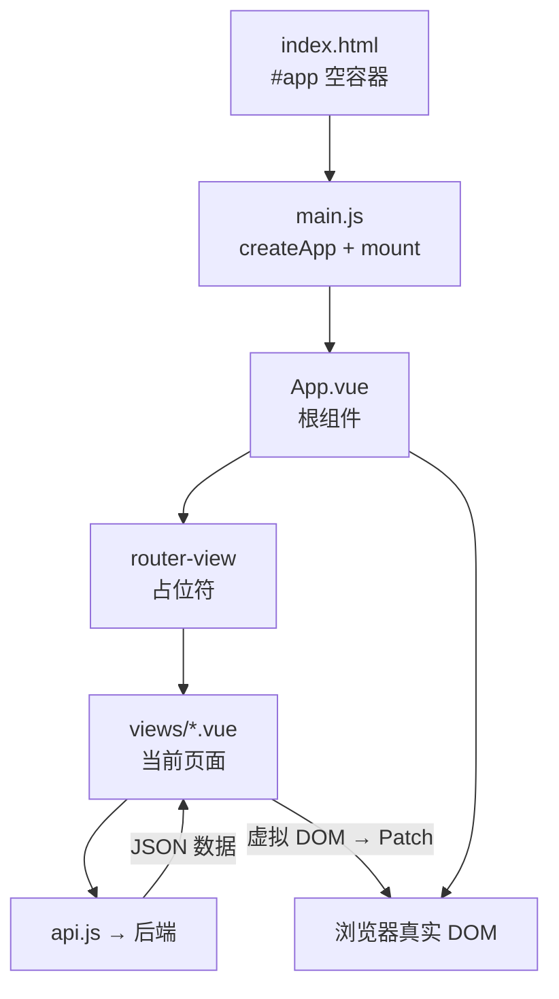
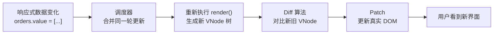

# SanyMES 前端代码详解 — Vue 新手学习指南

> 本文档面向 Vue 新手，**不只教你怎么写，更帮你理解框架背后在干什么**。如果你感觉 Vue「框架虽好但像黑盒」，请先读 **[第 0 章](#0-给新人从第一性原理理解-vue-而不是照葫芦画瓢)**，再按推荐顺序往下看。

---

## 目录

0. [给新人：从第一性原理理解 Vue，而不是照葫芦画瓢](#0-给新人从第一性原理理解-vue-而不是照葫芦画瓢)
   - [0.11 原生 JS 对照 Demo](#011-原生-js-对照-demo动手练)
   - [0.12 知识点太散？用 7 个概念收拢全部前端](#012-知识点太散用-7-个概念收拢全部前端)
1. [项目整体结构](#1-项目整体结构)
2. [技术栈一览](#2-技术栈一览)
3. [应用是如何启动的](#3-应用是如何启动的)
   - [3.2.1 深入理解：Vue 应用实例、use、component、mount 到底做了什么](#321-深入理解vue-应用实例usecomponentmount-到底做了什么)
   - [3.3 深入理解：挂载点、挂载与渲染原理](#33-深入理解挂载点挂载与渲染原理)
   - [3.3.4 深入理解：虚拟 DOM 与 Diff 算法](#334-深入理解虚拟-dom-与-diff-算法)
4. [Vue 3 核心概念（本项目用到的）](#4-vue-3-核心概念本项目用到的)
5. [单文件组件 .vue 的结构](#5-单文件组件-vue-的结构)
6. [全局入口与布局](#6-全局入口与布局)
7. [路由系统 router.js](#7-路由系统-routerjs)
8. [API 层 api.js](#8-api-层-apijs)
9. [全局样式 style.css](#9-全局样式-stylecss)
10. [六个页面逐一讲解](#10-六个页面逐一讲解)
11. [Element Plus 组件速查](#11-element-plus-组件速查)
12. [如何自己添加新功能](#12-如何自己添加新功能)
13. [常见问题 FAQ](#13-常见问题-faq)

---

## 0. 给新人：从第一性原理理解 Vue，而不是照葫芦画瓢

### 0.1 你的感受是对的

很多教程的套路是：

```
「在 template 里写 v-for，在 script 里写 ref，调 api.js 拿数据，好了。」
```

你能**抄出来**，但心里会空——

- `createApp` 是什么？不知道。
- `app.use` 为什么能装插件？不知道。
- 数据变了界面为什么自己变？不知道。
- 这行代码删了会怎样？不敢试。

**这不是你笨，是学习方式的问题。** 框架文档默认你已经接受了「声明式 UI」「响应式」「组件化」这些抽象。新人被直接扔进抽象层，底下全是雾。

本章给你一张**地图**：每个 Vue 概念底下，浏览器和 JavaScript 实际在干什么。有了地图，后面章节里的代码就不再是咒语。

---

### 0.2 四层模型：先懂底层，再看框架

把前端想成四层，**从下往上建**，每一层解决上一层管不了的事：

```
┌─────────────────────────────────────────────────────────┐
│  第 4 层：Vue / Element Plus / Router（框架层）          │
│  「帮你少写重复代码，自动同步数据和界面」                  │
├─────────────────────────────────────────────────────────┤
│  第 3 层：HTTP / JSON（前后端通信）                      │
│  「浏览器用 fetch/axios 向服务器要数据」                  │
├─────────────────────────────────────────────────────────┤
│  第 2 层：JavaScript（逻辑层）                           │
│  「变量、函数、对象、数组、async/await、事件」             │
├─────────────────────────────────────────────────────────┤
│  第 1 层：浏览器 / HTML / CSS / DOM（显示层）             │
│  「网页是什么、元素怎么显示、JS 怎么改页面」               │
└─────────────────────────────────────────────────────────┘
```

**新人常犯的错误：直接从第 4 层开始学。**

看到 `v-for` 就记「列表语法」，看到 `ref` 就记「定义变量语法」——全是框架方言，没有根。

**正确的感受方式：**

> 每看到一个 Vue API，问一句：**「如果没有 Vue，我用原生 JS 要怎么实现同样效果？」**

下面这张对照表就是答案。

---

### 0.3 核心对照表：Vue 写法 ↔ 没有 Vue 时你在干什么

| 你在本项目里看到的 | 框架帮你省掉的事 | 没有 Vue 时等价于… |
|-------------------|-----------------|-------------------|
| `<div id="app">` + `mount('#app')` | 指定 UI 渲染到哪里 | 你选一块 DOM 容器，往里面 `appendChild` |
| `App.vue` 的 `<template>` | 结构描述 | 写 HTML 字符串，或 `createElement` 拼 DOM |
| `ref(0)` + `{{ count }}` | 数据变 → 界面自动变 | 每次改数据后手动 `el.textContent = count` |
| `v-for="item in list"` | 列表渲染 | `list.forEach` + 循环 `createElement('tr')` |
| `v-if="show"` | 条件显示 | `el.style.display = show ? '' : 'none'` 或 removeChild |
| `@click="handleX"` | 事件绑定 | `el.addEventListener('click', handleX)` |
| `v-model="name"` | 输入框 ↔ 变量双向同步 | 监听 `input` 事件改变量 + 修改变量后改 `input.value` |
| `computed(() => ...)` | 派生数据自动重算 | 每次依赖变了，自己写函数重新算再改 DOM |
| `onMounted(fn)` | 组件出现在页面上时执行 | `window.onload` 或 DOM 插入后的回调 |
| `createApp` + `app` | 统一管理整个应用 | 一个全局对象持有配置、注册表、根组件 |
| `app.component('Monitor', ...)` | 全局组件名 → 组件定义 | 维护一个 `{ Monitor: 函数 }` 字典，渲染时查表 |
| `app.use(router)` | 安装路由能力 | 自己监听 `popstate`，根据 URL 显示/隐藏不同 div |
| `axios.get('/api/...')` | 发 HTTP 请求 | 和 Vue 无关，原生 `fetch()` 也行 |
| `<el-table :data="orders">` | 现成的复杂 UI | 自己写 `<table>` + 几十行 DOM 操作代码 |
| 虚拟 DOM + Diff | 高效、正确地更新 DOM | 你自己对比新旧数据，决定改哪几个节点 |

**一旦建立这张表，Vue 就不再是「新语法」，而是「把你已经会/本该会写的 JS+DOM 操作打包了」。**

---

### 0.4 用一段「原生 JS」模拟本项目的核心流程

下面**不用 Vue**，用浏览器原生 API 模拟 `Dashboard.vue` 加载工单列表。和项目里的 Vue 代码对照读，原理就通了。

**Vue 写法（本项目）：**

```javascript
const orders = ref([])
onMounted(async () => {
  orders.value = await getWorkOrders()
})
```

```html
<el-table :data="orders">...</el-table>
```

**等价原生 JS（帮助理解背后原理）：**

```javascript
// 1. 普通变量（还没有「响应式」）
let orders = []

// 2. 页面加载完成后请求数据（等价 onMounted）
async function init() {
  const res = await fetch('/api/work-orders')
  orders = await res.json()

  // 3. 没有 Vue 的话，你必须手动改 DOM（Vue 帮你自动做了这步）
  renderTable(orders)
}

// 4. 手动把数据画成表格
function renderTable(list) {
  const tbody = document.querySelector('#order-table tbody')
  tbody.innerHTML = ''                    // 清空旧内容
  list.forEach(order => {
    const tr = document.createElement('tr')
    tr.innerHTML = `
      <td>${order.order_no}</td>
      <td>${order.product.name}</td>
      <td>${order.customer}</td>
    `
    tbody.appendChild(tr)
  })
}

init()
```

**Vue 替你做的，就是第 3、4 步的自动化：**

```
orders.value = 新数据
    → Vue 知道哪些 DOM 绑定了 orders
    → 自动重新 render / Diff / Patch
    → 表格更新，你不用写 renderTable
```

所以 `ref` 不是「另一种变量语法」，而是 **「会被 Vue 监听的变量」**——变了就触发重新渲染。

---

### 0.5 读 Vue 代码的「三问法」（比背语法有用）

打开任意 `.vue` 文件，对每个陌生符号问三句：

| 问题 | 例子：`v-loading="loading"` |
|------|------------------------------|
| **1. 它想解决什么问题？** | 数据没回来时，给用户一个「加载中」提示 |
| **2. 没有 Vue 我怎么写？** | 显示一个遮罩 div，`loading` 为 true 时 `display:block`，false 时隐藏 |
| **3. 数据从哪来、到哪去？** | `loading` 在 script 里 `ref(true)`，API 返回后改 `false` |

再举一个：

| 问题 | 例子：`app.use(router)` |
|------|-------------------------|
| **1. 解决什么问题？** | URL 变了（/dashboard → /work-orders），中间内容区要换页面 |
| **2. 没有 Vue 我怎么写？** | 监听 URL，手动 `hide()` 旧 div、`show()` 新 div |
| **3. 数据从哪来到哪去？** | 用户点菜单 → URL 变 → Router 查路由表 → 加载对应 `.vue` 渲染进 `<router-view />` |

**能答出这三问，就不算照葫芦画瓢。**

---

### 0.6 框架为什么不友好？—— 因为它在卖「省略」

Vue 官方文档讲的是 **API 怎么用**，很少讲 **API 省略了什么**。

对新人来说，你需要的是反向文档：

```
ref        → 省略了：手动追踪依赖 + 手动更新 DOM
computed   → 省略了：每次相关变量变化时自己重算
组件       → 省略了：把 HTML/JS/CSS 打成一个可复用单元
Router     → 省略了：URL 解析 + 页面切换逻辑
Element Plus → 省略了：表格/表单/弹窗的 DOM 结构和交互
Vite       → 省略了：.vue 编译、热更新、开发服务器配置
```

**框架越强大，省略得越多，新人越觉得像黑盒。**

破解方法不是弃用框架，而是：**每学一个 API，花 5 分钟想一遍「它省略了什么」**。本文档 3.2.1、3.3、3.3.4 等章节就是在做这件事。

---

### 0.7 推荐学习顺序（为「理解原理」而排，不是为「快」）

```
阶段 0（本章）
  └─ 建立四层模型 + 对照表 + 三问法

阶段 1（浏览器基础，1～2 天）
  └─ HTML 结构、CSS 选择器、DOM 是什么
  └─ document.querySelector、addEventListener、createElement
  └─ 动手：写一个不依赖 Vue 的静态表格页

阶段 2（JavaScript 基础，2～3 天）
  └─ 变量、对象、数组、箭头函数
  └─ Promise / async-await（读 api.js 必备）
  └─ 动手：打开 **原生 JS 对照 Demo**（见 0.11 节），读源码 + 改代码实验

阶段 3（理解 Vue 在省略什么，3～5 天）
  └─ 读本文档 3.2.1 → 3.3 → 3.3.4（应用实例、挂载、虚拟 DOM）
  └─ 读第 4 章（ref、computed、v-for、v-model）
  └─ 动手：对照 native-demo.html，把 Materials.vue 里每一行 Vue 语法映射回去

阶段 4（读本项目代码，1 周）
  └─ Materials.vue（只读列表，最简单）
  └─ WorkOrders.vue（列表 + 表单 + API，完整 CRUD 模板）
  └─ Terminal.vue（复杂交互）
  └─ 动手：按第 12 章自己加一个页面

阶段 5（按需深入）
  └─ Vue Router 原理、Element Plus 文档、组件设计
```

**不要跳阶段。** 没写过原生 DOM 操作就看 `v-for`，一定会觉得魔法；写过 `forEach + appendChild` 再看 `v-for`，只会觉得「哦，语法糖」。

---

### 0.8 在本项目里「安全地拆」—— 验证你的理解

理解原理最好的方式不是背书，是**改一行、看会发生什么**。

| 实验 | 改什么 | 预期现象 | 你学到什么 |
|------|--------|----------|-----------|
| 1 | 注释 `app.mount('#app')` | 页面全白 | mount 是界面出现的开关 |
| 2 | 注释 `app.use(router)` | 中间内容区空白 | Router 插件提供了页面切换 |
| 3 | 注释图标 `app.component` 循环 | 侧边栏图标报错 | 全局注册 = template 能解析标签名 |
| 4 | `Dashboard.vue` 里删掉 `:key` | 列表可能乱（数据复杂时） | Diff 靠 key 识别列表项 |
| 5 | 把 `orders.value = await ...` 改成 `orders = await ...`（去掉 .value） | 表格不更新 | ref 必须用 .value 赋值才触发响应式 |
| 6 | Console 里 `console.log(app)` | 看到普通对象和方法 | app 不是魔法，是 JS 对象 |

**敢改、敢看报错，比多看十篇教程有用。**

---

### 0.9 什么时候可以「照葫芦画瓢」？

不是完全不能抄，而是**分场景**：

| 场景 | 可以抄 | 必须懂原理 |
|------|--------|-----------|
| Element Plus 表格列怎么写 | ✅ 查文档抄 | 知道 `:data` 绑的是数组即可 |
| 新建页面的文件结构 | ✅ 复制 Materials.vue 改 | 知道 script/template/style 各干什么 |
| `ref` / `computed` / `onMounted` | ❌ 不能只记格式 | 必须知道响应式和生命周期 |
| `app.use` / `mount` / 路由配置 | ❌ | 必须知道配置阶段 vs 运行阶段 |
| API 请求 + try/catch | ⚠️ 可复制模式 | 必须知道 Promise 和 async/await |

**口诀：抄「结构」和「UI 用法」，懂「数据流」和「生命周期」。**

---

### 0.10 本章小结：从「语法」切换到「问题」

| 旧思路（不友好） | 新思路（本文档推荐） |
|-----------------|---------------------|
| `ref` 是什么语法？ | 我想让变量变的时候界面自动变，怎么办？ |
| 为什么要 `app.use(router)`？ | 我想 URL 变就换页面，Router 帮我做了什么？ |
| `v-for` 怎么写？ | 我有一组数据要画成列表，框架怎么替我省略 DOM 操作？ |
| 报错看不懂 | 我改了哪一层（DOM/JS/HTTP/Vue）？ |

框架是工具，不是目的。**目的是：浏览器里正确显示数据、响应用户操作。**

Vue 只是实现这个目的的高阶手段。你现在已经有了：

- **第 0 章**：地图和三问法（本章）
- **3.2.1 节**：`createApp` / `use` / `component` / `mount` 拆盒
- **3.3 节**：挂载点与渲染
- **3.3.4 节**：虚拟 DOM 与 Diff
- **第 4～10 章**：本项目每个文件怎么用

**建议现在回到 [3.2.1 节](#321-深入理解vue-应用实例usecomponentmount-到底做了什么)，带着本章的对照表重读一遍 `main.js`，感受会完全不同。**

---

### 0.11 原生 JS 对照 Demo（动手练）

项目里提供了一个**不用 Vue** 的对照页面，和 Vue 版调同一套后端 API，方便并排理解。

**访问地址（需先启动前后端）：**

```
http://localhost:5173/native-demo.html
```

**文件位置：** `frontend/public/native-demo.html`

Vite 会把 `public/` 下的文件原样提供；`/api` 请求同样走 proxy 到后端。

**页面上有什么：**

| 功能 | 原生 Demo | Vue 等价 |
|------|-----------|----------|
| 加载工单列表 | `fetch` + `loadOrders()` | `onMounted` + `getWorkOrders()` |
| 统计卡片 | `renderStats()` 手动改 DOM | `computed` + `{{ }}` 自动更新 |
| 工单表格 | `renderTable()` + `createElement` | `el-table` + `:data="orders"` |
| Loading | `setLoading()` 改 display | `v-loading="loading"` |
| 下达工单 | `addEventListener('click')` | `@click="handleRelease(row)"` |

**推荐练习（按顺序做）：**

1. **并排打开两个浏览器标签**
   - 标签 A：`/native-demo.html`
   - 标签 B：`/work-orders`（Vue 版）
   - 对比同一批数据、同一「下达」操作

2. **读 native-demo.html 的 script 注释**
   - 分 6 部分：数据 → 工具函数 → DOM 渲染 → API → 业务 → 启动
   - 每部分开头都标注了 Vue 里对应的写法

3. **实验 A：注释掉 `renderTable(orders)`**
   - 刷新 → 有数据但表格空白
   - 理解：**改变量不会自动更新界面**，必须手动 render

4. **实验 B：注释掉 `renderStats(orders)`**
   - 表格有数据，统计卡片仍是 `-`
   - 理解：Vue 的 `computed` 省略了「每个相关 DOM 都要手动改」

5. **实验 C：在 Vue 版 WorkOrders.vue 里找 `handleRelease`**
   - 对比 native 里的 `handleRelease`
   - 业务逻辑一样：调 API → 提示 → 刷新列表
   - 差别只在：Vue 用 `ElMessage`，原生用 `alert`

6. **实验 D：自己加一列「数量」**
   - 先在 native-demo.html 的 `renderTable` 里加 `<td>${order.quantity}</td>`
   - 再在 `WorkOrders.vue` 里加 `<el-table-column prop="quantity" ...>`
   - 体验：原生要改 template 字符串 + 表头；Vue 加一行 column 声明

**源码底部的 4 道思考题**，建议做完实验后再看答案。

---

### 0.12 知识点太散？用 7 个概念收拢全部前端

感觉「前端知识点又多又杂」——这很正常。文档有两千多行，附录速查表二十多项，很容易焦虑。

**真相是：写本项目 80% 的代码，只需要 7 个概念。** 其余都是这 7 个的变体或进阶。

---

#### 一张总图：所有零散知识归到哪里

```
                         用户打开网页
                              │
                              ▼
              ┌───────────────────────────────┐
              │  ❶ 页面从哪来？                │
              │  index.html → main.js → mount │
              │  （第 3 章）                    │
              └───────────────┬───────────────┘
                              │
                              ▼
              ┌───────────────────────────────┐
              │  ❷ 界面长什么样？              │
              │  .vue 的 template（HTML）      │
              │  （第 5 章）                    │
              └───────────────┬───────────────┘
                              │
              ┌───────────────┴───────────────┐
              │                               │
              ▼                               ▼
┌─────────────────────────┐     ┌─────────────────────────┐
│  ❸ 数据从哪来？          │     │  ❹ 数据怎么显示？        │
│  api.js + fetch/axios   │────▶│  ref + {{ }} + v-for    │
│  onMounted 里请求        │     │  （第 4 章）             │
│  （第 8 章）              │     └────────────┬────────────┘
└─────────────────────────┘                  │
                              ┌────────────────┴────────────────┐
                              ▼                                 ▼
              ┌───────────────────────────┐   ┌───────────────────────────┐
              │  ❺ 用户点了怎么办？        │   │  ❻ 多页面怎么切换？        │
              │  @click + 函数改数据       │   │  router + router-view     │
              │  （第 4、10 章）           │   │  （第 7 章）               │
              └───────────────────────────┘   └───────────────────────────┘
                              │
                              ▼
              ┌───────────────────────────────┐
              │  ❼ 复杂 UI 不用自己拼          │
              │  Element Plus（el-table 等）   │
              │  （第 11 章，查文档即可）       │
              └───────────────────────────────┘
```

**上面 7 个问题，就是本项目的全部主线。** 其他名词都是支线：

| 你觉得零散的概念 | 其实是 7 个里的… |
|-----------------|-----------------|
| `createApp` / `app.use` / `mount` | ❶ 页面从哪来 |
| `<script setup>` / `.vue` 三件套 | ❷ 界面结构 |
| `axios` / `async-await` / `Promise.all` | ❸ 数据从哪来 |
| `ref` / `computed` / 虚拟 DOM / Diff | ❹ 数据怎么显示 |
| `@click` / `v-model` / `ElMessage` | ❺ 用户交互 |
| `router.js` / `$router.push` / `:id` | ❻ 多页面 |
| `el-table` / `el-dialog` / `el-form` | ❼ 现成 UI 组件 |

---

#### 只记 7 句话（背这个就够开工）

1. **启动**：`main.js` 把 `App.vue` 挂到 `#app` 上  
2. **结构**：每个页面是一个 `.vue` 文件，上面 HTML、中间 JS、下面 CSS  
3. **取数**：`onMounted` 里调 `api.js`，结果放进 `ref`  
4. **显示**：template 里用 `{{ }}` 和 `v-for` 把 `ref` 画出来  
5. **交互**：`@click` 调函数，函数里改 `ref` 或调 API，界面自动变  
6. **换页**：`router.js` 配路径，`<router-view />` 显示对应 `.vue`  
7. **UI**：表格、按钮、弹窗用 Element Plus，会查文档就行  

**新增一个页面的最小路径（只涉及 7 Concept）：**

```
api.js 加函数 → 新建 Xxx.vue（ref + onMounted + template）→ router.js 加路径 → App.vue 加菜单
```

第 12 章就是把这 4 步展开写而已。

---

#### 什么可以先不学（减轻负担）

| 可以先搁置 | 为什么 |
|-----------|--------|
| 虚拟 DOM / Diff 细节 | 知道「数据变 → 界面自动变」就够写代码 |
| `watch` / `provide` / `inject` | 本项目几乎用不到 |
| `:deep()` / CSS 变量 | 改样式时再查 |
| Vite 配置原理 | 能 `npm run dev` 就行 |
| TypeScript | 本项目全是 JS |
| 打包部署 | 能本地跑就行 |
| Pinia / Vuex 状态管理 | 本项目用 `ref` + API 足够 |

**不是永远不学，是「能写本项目」不必先学。**

---

#### 学散了的解药：每次只追一条线

不要「今天看 ref，明天看 Router，后天看 Vite」。**按一条用户路径串起来：**

```
用户打开 /work-orders
  → ❻ Router 加载 WorkOrders.vue
  → ❸ onMounted 调 getWorkOrders()
  → ❹ orders 放进 ref，el-table 显示
  → ❺ 用户点「下达」→ handleRelease → 调 API → 再 getWorkOrders
  → ❹ 表格自动刷新
```

找一条你关心的操作（比如 Terminal 报完工），在 DevTools 里从点击按钮跟到 API，**一条线走通，比看十遍目录有用。**

---

#### 和 backend 比：前端为什么感觉更散

| 后端（相对集中） | 前端（相对分散） |
|-----------------|-----------------|
| 一种语言（Python） | HTML + CSS + JS + 框架语法 |
| 逻辑在 service 层 | 逻辑、结构、样式分三个文件 |
| 改 API 改一处 | 改功能可能动 .vue + api.js + router.js |
| 输出是 JSON | 输出是「用户看得见的界面」 |

前端难，难在**横跨多种语言和层次**，不是难在某个单点。用 7 概念地图把层次分开，每次只关注一层，会轻松很多。

---

#### 给你的最小学习计划（1 周，不贪多）

| 天 | 只做一件事 |
|----|-----------|
| Day 1 | 读 0.12（本节）+ 玩 native-demo.html |
| Day 2 | 读 Materials.vue，对照 7 概念标注每一行 |
| Day 3 | 读 WorkOrders.vue，跟一遍「加载 → 点击 → 刷新」 |
| Day 4 | 复制 Materials.vue，改成一个「设备列表」练手（哪怕数据是假的） |
| Day 5 | 读 App.vue + router.js，理解菜单和换页 |
| Day 6 | 读 Terminal.vue 的 `@click` 和 `handleStart` |
| Day 7 | 按第 12 章加一个真实页面 |

**一周只掌握 7 个概念，比一个月零散看文档有效得多。**

---

## 1. 项目整体结构

```
frontend/
├── index.html          # 浏览器加载的 HTML 入口
├── package.json        # 项目依赖和脚本命令
├── vite.config.js      # Vite 构建工具配置
└── src/
    ├── main.js         # JavaScript 入口，创建 Vue 应用
    ├── App.vue         # 根组件（侧边栏 + 顶栏 + 内容区）
    ├── router.js       # 路由配置（URL → 页面映射）
    ├── api.js          # 后端 API 请求封装
    ├── style.css       # 全局 CSS 样式
    └── views/          # 各个页面组件
        ├── Dashboard.vue       # PCC 控制中心
        ├── WorkOrders.vue      # 工单列表
        ├── WorkOrderDetail.vue # 工单详情
        ├── Terminal.vue        # MES 终端机
        ├── Materials.vue       # 物料管理
        └── Quality.vue         # 质量管理
```

**数据流向：**

```
浏览器 URL 变化
    ↓
router.js 匹配路由
    ↓
加载对应的 views/*.vue 页面
    ↓
页面 onMounted 时调用 api.js 里的函数
    ↓
axios 发送 HTTP 请求到 /api/...
    ↓
Vite 代理转发到后端 localhost:8000
    ↓
后端返回 JSON 数据
    ↓
页面用 ref 存储数据，template 自动渲染
```

---

## 2. 技术栈一览

| 技术 | 作用 | 在本项目中的体现 |
|------|------|-----------------|
| **Vue 3** | 前端框架，负责 UI 渲染和交互 | 所有 `.vue` 文件 |
| **Vite** | 开发服务器 + 打包工具 | `vite.config.js`，`npm run dev` |
| **Vue Router** | 单页应用路由（不同 URL 显示不同页面） | `router.js` |
| **Element Plus** | UI 组件库（表格、按钮、表单等） | `el-table`、`el-button` 等 |
| **Axios** | HTTP 请求库 | `api.js` |
| **@element-plus/icons-vue** | Element Plus 图标 | `<Monitor />`、`<Plus />` 等 |

---

## 3. 应用是如何启动的

### 3.1 index.html — 浏览器的第一站

```html
<div id="app"></div>
<script type="module" src="/src/main.js"></script>
```

- `<div id="app">` 是 Vue 应用的**挂载点**（详见 [3.3 节](#33-深入理解挂载点挂载与渲染原理)）
- `type="module"` 表示用 ES Module 方式加载 JS（现代浏览器标准）

### 3.2 main.js — 创建 Vue 应用

```javascript
import { createApp } from 'vue'
import ElementPlus from 'element-plus'
import 'element-plus/dist/index.css'
import zhCn from 'element-plus/dist/locale/zh-cn.mjs'
import * as ElementPlusIconsVue from '@element-plus/icons-vue'
import App from './App.vue'
import router from './router'
import './style.css'

const app = createApp(App)          // ① 用 App.vue 创建应用

// ② 全局注册所有 Element Plus 图标
for (const [key, component] of Object.entries(ElementPlusIconsVue)) {
  app.component(key, component)
}

app.use(ElementPlus, { locale: zhCn })  // ③ 安装 Element Plus（中文）
app.use(router)                          // ④ 安装路由
app.mount('#app')                        // ⑤ 挂载到 #app
```

**关键概念：**

| 代码 | 含义 |
|------|------|
| `import X from 'Y'` | ES Module 导入，类似 Python 的 `from Y import X` |
| `createApp(App)` | 创建一个 Vue 应用实例（详见 [3.2.1 节](#321-深入理解vue-应用实例usecomponentmount-到底做了什么)） |
| `app.use(插件)` | 安装插件（详见 3.2.1 节） |
| `app.component(name, comp)` | 全局注册组件（详见 3.2.1 节） |
| `app.mount('#app')` | 把 Vue 应用「挂载」到 HTML 的 `#app` 元素里（详见 [3.3 节](#33-深入理解挂载点挂载与渲染原理)） |

#### 3.2.1 深入理解：Vue 应用实例、use、component、mount 到底做了什么

`main.js` 里这几行代码看起来像「黑盒咒语」。这一节把它们逐个拆开：**`app` 到底是什么对象、`createApp` / `use` / `component` / `mount` 分别在什么时候、对什么做了什么事**。

---

##### （1）先建立整体模型：配置阶段 vs 运行阶段

`main.js` 的执行其实分两个阶段：

```
┌─────────────────────────────────────────────────────────┐
│  配置阶段（mount 之前）—— 搭系统、装软件，但屏幕还黑着    │
│                                                         │
│  createApp(App)     → 创建「应用容器」app                │
│  app.component(...) → 往容器里登记全局组件               │
│  app.use(...)       → 往容器里安装插件                   │
└─────────────────────────────────────────────────────────┘
                          │
                          ▼  app.mount('#app')
┌─────────────────────────────────────────────────────────┐
│  运行阶段（mount 之后）—— 系统开机，界面出现、开始响应    │
│                                                         │
│  创建根组件实例 → 渲染 → 响应用户操作 → 更新 DOM         │
└─────────────────────────────────────────────────────────┘
```

**关键结论：`app` 是「应用级配置容器」，不是界面本身，也不是某个具体组件。**

在 `mount()` 之前，页面上**什么都没有**。前面所有 `use` / `component` 都只是在配置这个容器，为开机做准备。

---

##### （2）「Vue 应用实例」到底是什么？

执行：

```javascript
const app = createApp(App)
```

之后，`app` 是 Vue 内部 `createApp()` **返回的一个普通 JavaScript 对象**。不是 DOM，不是 `App.vue` 组件本身，而是管理整个应用的「总控对象」。

**类比：**

| 类比 | 对应关系 |
|------|----------|
| 手机 | `app`（应用实例） |
| 操作系统安装 | `createApp` + `use` + `component`（配置阶段） |
| 按电源键开机 | `app.mount('#app')` |
| 桌面界面 | 挂载后渲染出来的 UI |
| 预装 App | 全局注册的 `el-button`、`Monitor` 图标等 |

**`app` 对象上你能直接调用的方法（常用）：**

| 方法 | 作用 | 本项目 |
|------|------|--------|
| `app.component(name, comp)` | 全局注册组件 | 注册所有图标 |
| `app.use(plugin, options)` | 安装插件 | Element Plus、Router |
| `app.mount(selector)` | 挂载到 DOM，进入运行阶段 | `mount('#app')` |
| `app.config` | 全局配置（如错误处理） | 未使用 |
| `app.provide(key, val)` | 依赖注入 | 未使用 |

**`createApp(App)` 里的 `App` 是什么？**

`App` 不是 DOM，而是 **`App.vue` 编译后的组件定义对象**（组件的「蓝图」）：

```
App.vue 文件
    ↓ Vite 编译
{
  name: 'App',
  render: function() { ... },   // 由 <template> 编译而来
  setup: function() { ... },    // 由 <script setup> 编译而来
  __scopeId: 'data-v-xxxxx',    // scoped CSS 标识
}
```

`createApp(App)` 的意思是：**以 `App.vue` 这棵组件树作为整个应用的根**，后续所有 UI 都是它的子树。

**`app` 内部（概念上）大致有什么：**

```
app = {
  _component: App,              // 根组件蓝图（App.vue）
  _context: {                   // 整个应用共享的上下文
    app,                        // 指回 app 自身
    components: {},             // 全局组件注册表（component() 写入这里）
    directives: {},
    provides: {},
    config: { ... },
    ...
  },
  _instance: null,              // mount 之前为 null；mount 后是根组件实例
  // 以及 mount、use、component 等方法...
}
```

你不需要背这些字段，只要知道：**`app` 是一个带方法和内部状态的对象，用来统一管理「这个 Vue 应用」的全局配置。**

**动手验证：**

在 `main.js` 里临时加一行（学完可删）：

```javascript
const app = createApp(App)
console.log('app 对象:', app)
console.log('app 上有哪些方法:', Object.keys(app).filter(k => typeof app[k] === 'function'))
```

刷新页面，在 Console 里展开 `app`，能看到 `mount`、`use`、`component` 等函数——**它们不是魔法，就是对象上的方法。**

---

##### （3）`app.component()` — 全局注册组件，到底注册到哪？

```javascript
for (const [key, component] of Object.entries(ElementPlusIconsVue)) {
  app.component(key, component)
}
// 等价于：
app.component('Monitor', MonitorIconComponent)
app.component('Document', DocumentIconComponent)
app.component('Plus', PlusIconComponent)
// ... 几百个图标
```

**它做了什么（逐步）：**

```
1. 把组件定义存进 app 的全局注册表
   app._context.components['Monitor'] = MonitorIconComponent

2. mount 之后，本应用内任意 .vue 的 template 写 <Monitor />
   Vue 解析标签时查注册表 → 找到 MonitorIconComponent → 渲染图标

3. 不需要在每个 .vue 里 import Monitor
   因为已经「全局登记」过了
```

**App.vue 里可以直接写：**

```html
<el-icon><Monitor /></el-icon>
```

而没有 `import Monitor from '...'`，就是因为 `main.js` 里已经 `app.component('Monitor', ...)` 了。

**全局注册 vs 局部注册：**

| 方式 | 写法 | 谁能用 |
|------|------|--------|
| **全局注册** | `app.component('Monitor', ...)` in main.js | 整个应用任意组件 |
| **局部注册** | `import Xxx from './Xxx.vue'` in 某个 .vue | 只有该 .vue 及其 template |

本项目选择全局注册所有图标，因为几乎每个页面都可能用到，省去重复 import。

**`app.component()` 的时机：必须在 `mount()` 之前。**

```javascript
app.component('Monitor', Monitor)   // ✅ 有效
app.mount('#app')

app.component('Foo', Foo)           // ⚠️ mount 后再注册，已渲染的组件树不会自动获得
```

---

##### （4）`app.use()` — 「安装插件」到底安装了什么？

**插件（Plugin）** 是一包「扩展功能」，通常以对象或函数形式提供，必须实现 **`install(app, options)`** 方法（或插件本身就是函数）。

```javascript
app.use(插件, 可选配置)
```

Vue 内部大致执行：

```javascript
// Vue 源码逻辑（简化版）
function use(plugin, ...options) {
  if (typeof plugin === 'function') {
    plugin(app, ...options)           // 插件本身是函数，直接调用
  } else if (plugin.install) {
    plugin.install(app, ...options)   // 插件是对象，调 install
  }
  return app                          // 支持链式调用
}
```

**不是黑盒：就是调用插件提供的 `install` 函数，把 `app` 传进去，让插件自己往 app 上挂东西。**

---

**本项目插件 1：`app.use(ElementPlus, { locale: zhCn })`**

Element Plus 的 `install` 内部会做类似这些事：

```
1. 全局注册大量组件
   app.component('ElButton', ElButton)
   app.component('ElTable', ElTable)
   app.component('ElMenu', ElMenu)
   ... 几十个 el-xxx 组件

2. 应用传入的配置
   { locale: zhCn }  →  日期选择器、分页等显示中文

3. 可能注册全局指令、注入服务等
```

所以你在任何 `.vue` 里可以直接写 `<el-button>`、`<el-table>`，无需逐个 import——和图标全局注册是同一套机制，只是 Element Plus 在 `install` 里**批量**帮你注册了。

---

**本项目插件 2：`app.use(router)`**

`router` 来自 `router.js`：

```javascript
const router = createRouter({ history: createWebHistory(), routes })
export default router
```

Vue Router 的 `install(app)` 内部会做类似这些事：

```
1. 把 router 实例挂到 app 上，供全局使用
   app.config.globalProperties.$router = router
   app.config.globalProperties.$route = ...

2. 注册全局组件
   app.component('RouterView', RouterView)    // 即 <router-view />
   app.component('RouterLink', RouterLink)    // 即 <router-link />

3. 让 app 感知 URL 变化，驱动页面切换
```

所以 `App.vue` 里能写 `<router-view />`，`el-menu` 加 `router` 属性就能点击跳转——都是 Router 插件在 `install` 里注册好的。

---

**`use` 的执行顺序在本项目中有影响吗？**

```javascript
app.use(ElementPlus, { locale: zhCn })
app.use(router)
```

一般顺序影响不大。但若插件 A 依赖插件 B 注册的全局组件，则 B 要先 `use`。本项目 Element Plus 和 Router 相对独立。

**同一个插件不要重复 `use`：**

```javascript
app.use(router)
app.use(router)   // 开发环境可能警告，重复安装
```

---

##### （5）`app.mount('#app')` — 从配置到运行的开关

前面所有步骤都还在**内存里配置**。`mount` 是真正「开机」：

```
app.mount('#app')
    │
    ├─ 1. document.querySelector('#app')  找到 DOM
    ├─ 2. 用 app._component（App.vue）创建「根组件实例」
    │      app._instance = 根组件实例
    ├─ 3. 建立响应式、编译 render、首次渲染 VNode → 真实 DOM
    ├─ 4. 把 DOM 插入 #app
    ├─ 5. 触发 App.vue 的 onMounted
    └─ 6. 返回「根组件实例」（注意：不是 app 本身）
```

**三个容易混淆的概念：**

| 名称 | 是什么 | 何时存在 |
|------|--------|----------|
| **`app`** | 应用实例，配置容器 | `createApp` 之后 |
| **根组件定义 `App`** | App.vue 编译出的蓝图 | import 时就有 |
| **根组件实例** | 根据蓝图创建的运行时对象，有真实 data、DOM | `mount` 之后 |

```javascript
const app = createApp(App)
const rootInstance = app.mount('#app')

// app        → 应用总控（配置、插件、全局组件）
// rootInstance → App.vue 的运行实例（可访问 setup 里的 ref 等，一般很少直接用）
```

**`mount` 只能调用一次：**

一个 `app` 对应一次挂载、一个 DOM 容器。要开第二个独立 Vue 应用，需要再 `createApp(...).mount('#other')`。

---

##### （6）串起来：main.js 每一行在时间轴上的位置

```
时间 ──────────────────────────────────────────────────────────►

import App, router, ElementPlus ...
    │  只是加载模块，还没执行 Vue 逻辑

const app = createApp(App)
    │  创建 app 对象，根组件定为 App.vue
    │  页面：仍然空白

app.component('Monitor', ...)  × N
    │  全局组件表：{ Monitor, Document, Plus, ... }
    │  页面：仍然空白

app.use(ElementPlus, { locale: zhCn })
    │  全局组件表追加：{ ElButton, ElTable, ElMenu, ... }
    │  中文 locale 生效
    │  页面：仍然空白

app.use(router)
    │  注册 RouterView，绑定 URL 与路由表
    │  页面：仍然空白

app.mount('#app')
    │  ★ 界面出现：侧边栏 + 顶栏 + 当前路由页面
    │  用户可以看到并操作 MES 系统
```

---

##### （7）和「组件实例」的关系：app ≠ 你在页面里操作的组件

日常写代码时，你操作的是**各组件内部的 `ref`、`computed`**，不是 `app` 对象：

```javascript
// Dashboard.vue 里
const orders = ref([])    // 这是「Dashboard 组件实例」上的响应式数据
                          // 不是 app 上的

// main.js 里
const app = createApp(App)  // 这是「应用级」，整个程序只有这一个
```

层级关系：

```
app（应用实例，1 个）
 └── 根组件实例（App.vue，mount 创建，1 个）
      ├── el-aside 子组件实例
      ├── el-header 子组件实例
      └── router-view
           └── Dashboard 组件实例（当前页面）
                ├── orders (ref)
                ├── loading (ref)
                └── ...
```

**`app` 管全局配置；各 `.vue` 的 `setup` 管自己的局部状态。**

---

##### （8）如果不用这些 API，等价于什么？（帮助理解「做了什么」）

**没有 `app.component` 全局注册图标时：**

每个要用图标的文件都要写：

```javascript
import { Monitor, Document, Plus } from '@element-plus/icons-vue'
// 并在 components: { Monitor, Document, Plus } 注册
```

`app.component` 帮你**一次性登记，全局可用**。

**没有 `app.use(ElementPlus)` 时：**

每个 `.vue` 都要：

```javascript
import { ElButton, ElTable, ElCard, ElMenu, ... } from 'element-plus'
```

`app.use(ElementPlus)` 的 `install` **批量全局注册**所有 el- 组件。

**没有 `app.use(router)` 时：**

- 没有 `<router-view />`
- URL 变化不会切换页面
- 没有 `$router.push`

要自己实现 URL 解析和组件切换——Router 插件把这些打包好了。

**没有 `createApp` / `mount` 时：**

就没有 Vue 应用，只有普通 HTML + JS，一切响应式、组件化、自动更新 DOM 都不存在。

---

##### （9）动手验证：亲眼看到 use 和 component 的效果

**实验 1：注释掉图标注册**

```javascript
// for (const [key, component] of Object.entries(ElementPlusIconsVue)) {
//   app.component(key, component)
// }
```

刷新后，App.vue 侧边栏图标处会报错或空白，Console 类似：`Failed to resolve component: Monitor`。

说明：**component 确实把名字映射到了组件定义，template 才能解析 `<Monitor />`。**

**实验 2：注释掉 `app.use(router)`**

```javascript
// app.use(router)
```

刷新后：`<router-view />` 不工作，中间内容区空白；菜单点击可能无效。

**实验 3：注释掉 `app.use(ElementPlus)`**

`<el-container>`、`<el-menu>` 等全部无法识别，页面结构崩溃。

**实验 4：在 mount 前 console.log**

```javascript
console.log(app._context.components)  // 可能因 Vue 版本访问方式不同，DevTools 更直观
app.mount('#app')
```

用 **Vue DevTools** → 应用根节点，可看到已注册的全局组件列表。

---

##### （10）本节小结：拆黑盒

| API | 一句话 | 发生时机 | 页面是否可见 |
|-----|--------|----------|--------------|
| `createApp(App)` | 创建应用容器 `app`，指定根组件蓝图 | 第一行 | 否 |
| `app.component(name, comp)` | 往全局注册表登记组件，template 可直接用标签名 | mount 前 | 否 |
| `app.use(plugin, opts)` | 调用插件的 `install(app)`，扩展全局能力 | mount 前 | 否 |
| `app.mount('#app')` | 创建根组件实例、首次渲染、插入 DOM | 最后一行 | **是** |

**「Vue 应用实例」= 一个 JS 对象 + 一套全局配置 + 若干方法**，用来在真正渲染之前把根组件、插件、全局组件都准备好；**`mount` 是按下电源键**，之后才是你在 3.3、3.3.4 节学到的渲染、虚拟 DOM、Diff 流程。

---

### 3.3 深入理解：挂载点、挂载与渲染原理

这一节把「挂载点」「挂载」「渲染」三个概念彻底讲清楚。搞懂之后，你就能理解：为什么 `index.html` 里只有一个空 `<div>`，刷新页面后却出现了完整的 MES 界面。

---

#### 3.3.1 什么是 Vue 应用的挂载点？

**挂载点（Mount Point）** 就是 HTML 页面里一个**普通的 DOM 元素**，Vue 把整棵组件树最终「画」在这个元素里面（或取代它）。

在本项目中，挂载点就是：

```html
<div id="app"></div>
```

**挂载前，浏览器里实际长这样：**

```html
<body>
  <div id="app"></div>   <!-- 空的，页面上什么都看不到 -->
</body>
```

**几个关键理解：**

| 问题 | 答案 |
|------|------|
| 挂载点必须是 `id="app"` 吗？ | **不是**。可以是任何选择器，如 `#root`、`.container`，只要 `mount()` 里写的选择器能匹配到即可 |
| 挂载点里需要预先写 HTML 吗？ | **不需要**。通常留空，全部由 Vue 生成；也可以写初始内容（挂载时会被替换） |
| 挂载点可以有多个吗？ | 一个 Vue 应用通常只 `mount()` **一次**、挂到**一个** DOM 节点上 |
| `#app` 是什么意思？ | CSS 选择器，`#` 表示按 id 查找，等价于 `document.querySelector('#app')` |

**类比理解：**

可以把挂载点想象成一块**空白画布**：

```
┌─────────────────────────────────────┐
│  index.html（整个网页）               │
│  ┌───────────────────────────────┐  │
│  │  <div id="app">               │  │  ← 画布（挂载点）
│  │    （Vue 接管后在这里作画）      │  │
│  └───────────────────────────────┘  │
└─────────────────────────────────────┘
```

Vue 不负责创建 `<body>`、`<html>` 这些浏览器基础结构——那些由 `index.html` 提供。Vue 只负责把**应用 UI** 画进 `#app` 这块区域。

**为什么传统多页网站不需要挂载点？**

传统网站每个页面都是后端直接返回完整 HTML，浏览器原样显示。而 Vue 是 **SPA（单页应用）**：服务器只给一份 `index.html` + JS，**所有页面切换都在前端完成**，因此必须有一个固定容器让 JS 往里动态插入 UI。这个容器就是挂载点。

---

#### 3.3.2 如何挂载？——从 `createApp` 到 `mount`

挂载分两个阶段：**创建应用实例** 和 **挂载到 DOM**。

```javascript
const app = createApp(App)   // 阶段一：在内存中创建应用（还没出现在页面上）
app.use(ElementPlus)
app.use(router)
app.mount('#app')            // 阶段二：挂载到真实 DOM
```

**阶段一：`createApp(App)` — 在内存里搭架子**

```
createApp(App)
    │
    ├─ 根组件 = App.vue（整个应用的顶层组件）
    ├─ 创建响应式系统（后续 ref/computed 的基础）
    ├─ 创建虚拟 DOM 渲染器
    └─ 返回 app 对象（可继续 .use() 装插件）
```

此时页面上**仍然什么都没有**。`app` 对象只是 JavaScript 里的一个实例，和 DOM 还没有任何关系。

你可以把这个阶段的 `app` 理解成：工厂已经建好，但产品还没出厂。

**阶段二：`app.mount('#app')` — 接到真实页面上**

`mount()` 内部大致做了这些事：

```
1. document.querySelector('#app')     → 找到挂载点 DOM 元素
2. 创建 App.vue 的组件实例
3. 编译 App.vue 的 <template>        → 生成渲染函数
4. 执行首次渲染                      → 生成真实 DOM
5. 把 DOM 插入 #app                  → 用户看到界面
6. 触发根组件的 onMounted 生命周期
7. 返回根组件实例
```

**挂载前后 DOM 对比（简化示意）：**

挂载前：
```html
<div id="app"></div>
```

挂载后（结构简化，实际 DOM 更复杂）：
```html
<div id="app" data-v-app>
  <section class="el-container layout">
    <aside class="el-aside sidebar">...</aside>      <!-- 侧边栏 -->
    <section class="el-container">
      <header class="el-header">...</header>          <!-- 顶栏 -->
      <main class="el-main">
        <!-- router-view 渲染的当前页面，如 Dashboard -->
      </main>
    </section>
  </section>
</div>
```

**`mount()` 的参数写法：**

```javascript
app.mount('#app')                    // CSS 选择器字符串（本项目用法）
app.mount(document.querySelector('#app'))  // 直接传 DOM 元素也可以
```

**注意：`mount()` 通常只调用一次**

如果对同一个 `app` 多次 `mount()`，或创建多个 app 挂到同一节点，会报错或行为异常。本项目的 `main.js` 在应用启动时执行一次 `mount('#app')`，之后不再重复。

**完整启动时序（结合本项目）：**

```
用户打开 http://localhost:5173
    │
    ▼
浏览器加载 index.html
    │
    ├─ 解析到 <div id="app"></div>（空容器就位）
    └─ 执行 <script src="/src/main.js">
           │
           ▼
       main.js 执行
           │
           ├─ import App from './App.vue'
           ├─ const app = createApp(App)
           ├─ app.use(ElementPlus)
           ├─ app.use(router)
           └─ app.mount('#app')  ← 关键时刻：界面出现
```

---

#### 3.3.3 如何进行渲染？——从组件树到屏幕像素

「渲染」是指 Vue 把**组件的 template 描述** 转换成**浏览器能显示的 DOM 节点** 的过程。

##### （1）组件树：谁在渲染谁

本项目挂载后形成一棵**组件树**（从外到内）：

```
App.vue（根组件，main.js 挂载的入口）
├── el-aside（侧边栏）
│   ├── el-menu
│   │   └── el-menu-item × 5
│   └── ...
├── el-header（顶栏）
└── el-main
    └── <router-view />          ← 占位符，内容由路由决定
            │
            └── Dashboard.vue    ← 当前 URL 是 /dashboard 时
                    ├── el-row / el-col（统计卡片）
                    ├── el-table（在制工单）
                    └── ...
```

**规则：父组件的 template 里写了什么子组件，子组件就渲染在对应位置。**

`App.vue` 第 54 行：

```html
<router-view />
```

这是一个**占位符**。Vue Router 根据当前 URL，把对应页面组件（如 `Dashboard.vue`）渲染在这里。所以切换菜单时，侧边栏和顶栏不变，只有中间内容区变化——这就是 SPA 的核心体验。

##### （2）template → 渲染函数 → 虚拟 DOM → 真实 DOM

以 `App.vue` 顶栏中的一行为例：

```html
<span class="header-title">{{ currentTitle }}</span>
```

Vue 内部的处理流程：

```
① 编译阶段（开发时由 Vite + @vitejs/plugin-vue 完成）
   <span>{{ currentTitle }}</span>
        ↓ 编译
   渲染函数 render() { return h('span', { class: 'header-title' }, currentTitle) }

② 首次渲染
   执行 render() → 得到「虚拟 DOM」树（JS 对象描述 DOM 结构）
        ↓
   虚拟 DOM 转成真实 DOM 节点
        ↓
   插入到 #app 对应位置

③ 数据变化后（响应式更新）
   currentTitle 从 'SanyMES' 变为 'PCC 生产控制中心'（路由切换）
        ↓
   渲染函数重新执行 → 新的虚拟 DOM
        ↓
   与旧虚拟 DOM 对比（Diff 算法）→ 发现只有文本变了
        ↓
   只更新那一个 <span> 的文本内容（不重建整页）
```

虚拟 DOM 和 Diff 是 Vue 渲染机制的核心。上面只是概览，**完整原理见 [3.3.4 节](#334-深入理解虚拟-dom-与-diff-算法)**。

##### （3）响应式驱动重新渲染

以 `Dashboard.vue` 为例：

```javascript
const loading = ref(true)
const orders = ref([])

onMounted(async () => {
  orders.value = await getWorkOrders()   // ① 数据赋值
  loading.value = false                  // ② 关闭 loading
})
```

```html
<el-table :data="orders" v-loading="loading">
```

当 `orders.value` 被赋值时：

```
orders.value = [...数据...]
    ↓
Vue 检测到 orders 是响应式数据，值变了
    ↓
标记使用 orders 的组件需要「重新渲染」
    ↓
重新执行 Dashboard.vue 的 render 函数
    ↓
el-table 收到新的 :data，表格显示工单列表
    ↓
loading 变为 false，v-loading 遮罩消失
```

**你不需要手动操作 DOM**（不用 `document.getElementById` 去改表格内容）。只改数据，Vue 自动更新界面——这是 Vue 的核心价值。

##### （4）本项目的完整渲染链路（一次页面访问）

以用户访问 `/dashboard` 为例：

```
1. index.html 加载，#app 为空

2. main.js 执行 mount('#app')
   → 渲染 App.vue（侧边栏 + 顶栏 + 空的 router-view）

3. Vue Router 匹配 /dashboard
   → 懒加载 import('./views/Dashboard.vue')
   → 把 Dashboard.vue 渲染进 <router-view />

4. Dashboard onMounted 触发
   → 并行请求 getDashboard()、getWorkOrders()、getStations()

5. 请求返回，stats/orders/stations 赋值
   → 响应式触发 Dashboard 重新渲染
   → 统计卡片、表格、工位网格出现在屏幕上

6. 用户点击「工单管理」菜单
   → URL 变为 /work-orders
   → Router 卸载 Dashboard，挂载 WorkOrders.vue
   → App.vue 侧边栏/顶栏不重新渲染（组件被复用）
   → 只有 <router-view /> 区域换成工单列表
```

用图表示：



##### （5）三个概念的关系小结

| 概念 | 是什么 | 在本项目中的体现 |
|------|--------|-----------------|
| **挂载点** | HTML 里的一个 DOM 容器 | `<div id="app"></div>` |
| **挂载** | 把 Vue 应用接到挂载点上的动作 | `app.mount('#app')` |
| **渲染** | 把组件 template + 数据变成真实 DOM 的过程 | App → router-view → Dashboard → 表格/卡片显示 |

一句话串起来：

> 浏览器提供空的 `#app` 作为**挂载点**；`main.js` 调用 `mount('#app')` 完成**挂载**；Vue 从 `App.vue` 开始，沿组件树逐层**渲染** template，响应式数据变化时自动更新 DOM，最终用户看到完整的 MES 界面。

##### （6）动手验证：在浏览器里亲眼看到挂载点

1. 启动项目，打开 http://localhost:5173
2. 按 **F12** 打开开发者工具 → **Elements（元素）** 面板
3. 展开 `<body>` → 找到 `<div id="app" data-v-app>`
4. 你会看到 `#app` 里面已经充满了 Vue 生成的 DOM 结构
5. 切换到 **Console**，输入：

```javascript
document.querySelector('#app').innerHTML.length
```

会返回一个很大的数字——说明原本空的 `#app` 里已经被 Vue 填满了内容。

6. 在 Vue DevTools（Chrome 插件）中可以看到完整的**组件树**，和上面 3.3.3(1) 的示意图一一对应。

#### 3.3.4 深入理解：虚拟 DOM 与 Diff 算法

3.3.3 节提到了「虚拟 DOM」和「Diff」，但没有展开。这一节专门讲清楚：**它们是什么、为什么需要、Vue 怎么用它们更新界面**。搞懂之后，你就能理解 `v-for` 为什么要写 `:key`、为什么改数据界面会自动变、以及 Vue 到底「慢不慢」。

---

##### （1）先理解真实 DOM：为什么不宜频繁直接操作？

**真实 DOM（Real DOM）** 是浏览器根据 HTML 构建的一棵树，每个节点都是浏览器里的真实对象。

```html
<span class="header-title">PCC 生产控制中心</span>
```

在浏览器里，这不仅仅是一行文字，而是一个**节点对象**，包含：

- 标签名、属性、样式、事件监听器
- 父子关系（挂在哪棵 DOM 树上）
- 布局信息（浏览器要重新计算页面排版）

**直接操作真实 DOM 的成本：**

| 操作 | 代价 |
|------|------|
| `document.createElement()` | 创建节点对象 |
| `element.textContent = '...'` | 修改可能触发样式重算 |
| `parent.appendChild()` | 改变树结构，可能触发**回流（reflow）** |
| 大量节点增删改 | 浏览器反复计算布局，页面卡顿 |

**传统 jQuery 式写法（Vue 之前常见）：**

```javascript
// 每次数据变了，手动找 DOM、改 DOM
const el = document.querySelector('.order-count')
el.textContent = orders.length
```

工单列表有 10 条变 11 条时，你要自己决定：是改文本？删一行？插一行？很容易和真实数据**不同步**。

Vue 的思路是：**你只改数据，DOM 怎么变交给框架**。虚拟 DOM + Diff 就是实现这一点的核心机制。

---

##### （2）什么是虚拟 DOM？

**虚拟 DOM（Virtual DOM，简称 VDOM）** 是用 **JavaScript 对象** 描述 DOM 结构的一份「草稿」，存在于内存中，不是浏览器里真实的节点。

一个真实 DOM 节点：

```html
<span class="header-title">PCC 生产控制中心</span>
```

对应的虚拟 DOM 节点（Vue 内部叫 **VNode**）概念上类似：

```javascript
{
  type: 'span',                        // 标签名（或组件）
  props: { class: 'header-title' },    // 属性
  children: 'PCC 生产控制中心',          // 子节点（文本或更多 VNode）
  key: null,                           // 列表 diff 用
  el: null,                            // 首次渲染后，指向对应的真实 DOM 节点
}
```

**整棵组件的 template 会生成一棵 VNode 树：**

```
VNode: el-container
├── VNode: el-aside
│   └── VNode: el-menu
│       └── VNode: el-menu-item × 5
├── VNode: el-header
│   └── VNode: span.header-title  →  children: "PCC 生产控制中心"
└── VNode: el-main
    └── VNode: Dashboard 组件
        └── ...
```

**VNode 从哪来？——`h()` 渲染函数**

Vue 把 `<template>` 编译成 `render()` 函数，执行后返回 VNode 树。`h` 是 createElement 的简写：

```javascript
// 概念上等价于 <span class="header-title">{{ currentTitle }}</span>
h('span', { class: 'header-title' }, currentTitle)
```

本项目里你不会直接写 `h()`，但每个 `.vue` 的 `<template>` 最终都会被编译成类似的函数。

**虚拟 DOM 的特点：**

| 特点 | 说明 |
|------|------|
| 纯 JS 对象 | 在内存里创建/销毁很快 |
| 轻量 | 没有布局、绘制负担 |
| 可对比 | 两份 VNode 树可以做 Diff |
| 中间层 | 连接「数据」和「真实 DOM」 |

**常见误解澄清：**

| 误解 | 事实 |
|------|------|
| 虚拟 DOM 比真实 DOM 快 | **不一定**。单次更新，直接改一个 DOM 可能更快 |
| Vue 每次都会重建整页 | **不会**。Diff 后只 Patch 变化的部分 |
| 虚拟 DOM 就是 Shadow DOM | **不是**。Shadow DOM 是浏览器 Web Components 特性，与 Vue VNode 无关 |

虚拟 DOM 的核心价值是：**用可预测的算法，把「数据 → UI」的更新自动化，并在复杂界面下减少不必要的真实 DOM 操作**。

---

##### （3）完整更新流程：从数据变化到屏幕刷新

把 3.3.3 里分散的步骤串成一条完整流水线：



**各阶段职责：**

| 阶段 | 做什么 |
|------|--------|
| **Trigger（触发）** | `ref` / `computed` 等响应式数据被修改 |
| **Scheduler（调度）** | Vue 3 把同一事件循环内的多次修改**合并**成一次渲染（避免改 10 个变量就渲染 10 次） |
| **Render（渲染）** | 组件 `render()` 根据**最新数据**生成**新 VNode 树** |
| **Diff（对比）** | 拿**新 VNode 树**和**旧 VNode 树**逐层比较，找出差异 |
| **Patch（修补）** | 把差异应用到**真实 DOM**（改文本、增删节点、改属性） |

**首次渲染 vs 更新渲染：**

```
首次渲染（mount 时）：
  render() → VNode 树 → 直接创建真实 DOM → 插入 #app
  （没有「旧树」，不需要 Diff）

更新渲染（数据变化时）：
  render() → 新 VNode 树
  旧 VNode 树（上次渲染保留在内存）
       ↓ Diff
  最小变更集 → Patch 到已有真实 DOM
```

---

##### （4）Diff 算法：如何对比两棵 VNode 树？

**Diff（差异对比）** 的任务：给定旧 VNode 树和新 VNode 树，找出**最少需要动真实 DOM 的修改方案**。

如果对两棵任意树做全量对比，复杂度是 O(n³)，太慢。Vue 借鉴了同层比较策略，把问题简化为 **O(n)** 级别。

**核心策略 1：只比较同一层的节点，不跨层移动**

```
旧树          新树
  A             A
 / \           / \
B   C         B   D    ← C 变 D：同层替换，不试图把 C「挪」到别处
```

Vue 假设：**DOM 结构变化通常是同层级的**（比如一个 `<div>` 换成另一个 `<div>`），不会频繁把整个子树搬到另一层。这样只需逐层向下比较。

**核心策略 2：类型不同 → 直接替换整棵子树**

```javascript
// 旧 VNode
{ type: 'span', children: '旧标题' }

// 新 VNode
{ type: 'div', children: '新标题' }
```

标签从 `span` 变成 `div`，Vue **不会**尝试复用里面的内容，而是：**删掉旧真实 DOM 节点，创建新的**。

**核心策略 3：类型相同 → 复用节点，只改差异**

```javascript
// 旧
{ type: 'span', props: { class: 'header-title' }, children: 'SanyMES' }

// 新
{ type: 'span', props: { class: 'header-title' }, children: 'PCC 生产控制中心' }
```

标签和 class 一样 → **复用同一个真实 `<span>` 节点**，只把 `textContent` 从 `SanyMES` 改成 `PCC 生产控制中心`。

这就是路由切换时顶栏标题更新的实际过程——**只改文字，不重建整个 header**。

**核心策略 4：列表必须用 `:key`（本项目处处都在用）**

`Dashboard.vue` 中：

```html
<el-col :span="6" v-for="item in statCards" :key="item.label">
```

假设 `statCards` 从：

```javascript
[
  { label: '工单总数', value: 3 },
  { label: '生产中', value: 2 },
]
```

变成（插入一项到中间）：

```javascript
[
  { label: '工单总数', value: 3 },
  { label: '待下达', value: 1 },   // 新增
  { label: '生产中', value: 2 },
]
```

**没有 key 时**，Diff 按位置比较：

```
位置 0：工单总数 vs 工单总数  → 可能只改 value（还好）
位置 1：生产中   vs 待下达    → 错！把第 2 项的内容硬改成第 1 项新增的内容
位置 2：（无）   vs 生产中    → 再改一次
```

列表项有输入框、动画、组件内部状态时，会出现**错位、状态混乱**。

**有 `:key="item.label"` 时**，Diff 按 key 匹配：

```
key=工单总数 → 找到旧树同 key 节点 → 复用，只更新 value
key=待下达   → 旧树没有 → 插入新节点
key=生产中   → 找到旧树同 key 节点 → 复用，可能更新位置
```

**`:key` 的选择原则（写代码时记住）：**

| 推荐 | 不推荐 |
|------|--------|
| 数据库 `id`（如 `row.id`） | 数组下标 `index`（排序/删插后会乱） |
| 业务唯一字段（如 `order_no`） | 随机数（每次渲染都变，无法复用） |
| 组合唯一（如 `item.label` 在本列表内唯一） | 重复 key |

---

##### （5）Patch：把 Diff 结果写到真实 DOM

**Patch** 是 Diff 的下一步：根据对比结果，执行具体的 DOM 操作。

| Diff 结论 | Patch 操作 |
|-----------|-----------|
| 文本变了 | `node.textContent = '新文本'` |
| 属性变了 | `node.setAttribute` / `className` 等 |
| 新节点 | `document.createElement` + `appendChild` |
| 节点删除 | `parent.removeChild` |
| 子节点顺序变了 | `insertBefore` 移动节点 |

**结合本项目：Dashboard 加载工单列表**

```javascript
// 1. 初始：orders = []
orders.value = []          // 表格区域 VNode：el-table，children 为空

// 2. API 返回后
orders.value = [           // 触发响应式
  { order_no: 'WO-001', ... },
  { order_no: 'WO-002', ... },
  { order_no: 'WO-003', ... },
]

// 3. Vue 内部（简化描述）
//    - 重新 render Dashboard
//    - 新 VNode 树里 el-table 多了 3 行
//    - Diff：发现 table body 从 0 行变 3 行
//    - Patch：创建 3 个 <tr> 插入 tbody（不是重建整个 table）
```

你在代码里只写了一行 `orders.value = await getWorkOrders()`，背后是：**render → Diff → Patch** 自动完成。

---

##### （6）用本项目三个真实场景串一遍

**场景 A：顶栏标题随路由变化（最小 Patch — 只改文本）**

```
用户从 /dashboard 点到 /work-orders

currentTitle: 'PCC 生产控制中心' → '工单管理'
    ↓
App.vue 重新 render
    ↓
Diff：<span.header-title> 同类型同 class，仅 children 文本不同
    ↓
Patch：只改一个 span 的 textContent
    ↓
侧边栏 DOM 完全不动
```

**场景 B：工单列表从 loading 到显示数据（局部插入节点）**

```
loading: true → false
orders: [] → [3 条工单]

Dashboard 重新 render
    ↓
Diff：
  - v-loading 遮罩层移除
  - el-table tbody 从空变为 3 行
    ↓
Patch：去掉 loading 元素，向 tbody 插入 3 行 <tr>
```

**场景 C：Terminal 报完工后刷新（数据驱动整表更新）**

```javascript
await completeTask(...)
await reload()   // orders.value = await getWorkOrders()
```

新数据里某个 `station_tasks[].status` 从 `in_progress` 变为 `completed`：

```
Diff 到对应行的状态标签 class：status-in_progress → status-completed
Patch：改 class + 文本，按钮 disabled 状态跟着变
```

---

##### （7）和「手动操作 DOM」的对比

以在工单表格末尾加一行为例：

**手动 DOM（传统方式）：**

```javascript
const tbody = document.querySelector('.el-table tbody')
const tr = document.createElement('tr')
tr.innerHTML = `<td>WO-004</td><td>泵车</td>...`
tbody.appendChild(tr)
// 还要自己维护：内存里的 orders 数组是否也加了这一条？
```

**Vue 方式（本项目）：**

```javascript
orders.value.push(newOrder)   // 只改数据
// render → Diff → Patch 自动加一行
// 数据和界面永远一致
```

| 维度 | 手动 DOM | Vue 虚拟 DOM |
|------|----------|--------------|
| 你要写什么 | 找节点 + 改 DOM + 同步数据 | 只改数据 |
| 出错风险 | 数据和界面容易不一致 | 单一数据源 |
| 性能 | 简单场景可能更快 | 复杂 UI 下更可控 |
| 可维护性 | 逻辑散落各处 | 声明式 template |

---

##### （8）Vue 3 在这套机制上的两个优化（了解即可）

**① 静态提升（编译期优化）**

编译 template 时，不会变的部分（纯静态 HTML）只创建一次 VNode，后续渲染**复用**，不参与 Diff。

例如 `App.vue` 侧边栏里不变的 logo 结构，不会每次路由切换都重新对比。

**② 调度器批量更新**

```javascript
stats.value.total_orders = 10
stats.value.in_progress_orders = 5
stats.value.completed_orders = 3
// 三次赋值，只触发一次 render + Diff + Patch
```

同一「微任务」内的多次数据修改会被合并，避免连续闪动和重复渲染。

---

##### （9）你需要记住的实践要点

写本项目代码时，和虚拟 DOM / Diff 直接相关的习惯：

1. **`v-for` 必须写稳定唯一的 `:key`**（见 `Dashboard.vue`、`WorkOrders.vue`）
2. **用 `ref` 存数据，让 template 声明界面**，不要 `document.querySelector` 改 DOM
3. **条件渲染用 `v-if`** 时，切换会销毁/重建子树（Diff 视为节点替换）；频繁切换可考虑 `v-show`（只改 `display`，节点仍在）
4. **大列表性能**：key 正确、避免在 template 里写过重计算（用 `computed` 代替）
5. **数据变化但界面没变？** 检查是否改了非响应式对象（忘了 `.value`，或直接改数组下标未触发更新等）

---

##### （10）动手验证：观察一次更新

1. 打开 http://localhost:5173/dashboard ，F12 → **Elements**
2. 找到统计卡片「生产中」对应的 `.value` 文本节点
3. 切换到 **Console**，注意：不要真的改后端，只是理解流程
4. 点击侧边栏「工单管理」再切回「PCC 控制中心」
5. 观察 Elements 面板：**侧边栏 DOM 节点 id/结构基本不变**，只有 `<router-view>` 内部整块替换
6. 安装 **Vue DevTools** → 选中 `Dashboard` 组件 → 看 `orders`、`stats` 响应式数据；在 Terminal 点「报完工」后看数据变化触发的组件更新高亮（Highlight updates）

---

##### （11）本节小结

| 概念 | 一句话 |
|------|--------|
| **真实 DOM** | 浏览器里的节点树，改动成本高 |
| **虚拟 DOM（VNode）** | 用 JS 对象描述 UI 结构的内存草稿 |
| **render()** | 根据当前数据生成 VNode 树 |
| **Diff** | 对比新旧 VNode，找出最小差异 |
| **Patch** | 把差异应用到真实 DOM |
| **`:key`** | 帮 Diff 正确识别列表项身份，避免错位复用 |

回到 3.3.3 里的那句话，现在可以读得更透彻：

> 数据变化 → 重新生成虚拟 DOM → Diff 对比 → Patch 更新真实 DOM

你写 `orders.value = await getWorkOrders()`，剩下的交给 Vue。

---

### 3.4 vite.config.js — 开发服务器配置

```javascript
export default defineConfig({
  plugins: [vue()],       // 让 Vite 能处理 .vue 文件
  server: {
    port: 5173,           // 前端运行在 5173 端口
    proxy: {
      '/api': {
        target: 'http://localhost:8000',  // 把 /api 请求转发到后端
        changeOrigin: true,
      },
    },
  },
})
```

**为什么需要 proxy？**

前端运行在 `localhost:5173`，后端在 `localhost:8000`。浏览器有跨域限制，不能直接请求不同端口。Vite 的 proxy 会在开发时把 `/api/xxx` 悄悄转发到 `localhost:8000/api/xxx`，对前端代码透明。

---

## 4. Vue 3 核心概念（本项目用到的）

### 4.1 响应式数据 — ref

```javascript
import { ref } from 'vue'

const loading = ref(true)    // 创建一个响应式变量
const orders = ref([])       // 初始值是空数组

loading.value = false        // 修改值要用 .value（在 script 里）
orders.value = await getWorkOrders()
```

- `ref()` 包裹的值是**响应式**的：当它变化时，页面上用到它的地方会**自动更新**
- 在 `<template>` 里使用时**不需要** `.value`，Vue 会自动解包
- 在 `<script setup>` 里使用时**需要** `.value`

```html
<!-- template 里直接用，不需要 .value -->
<div v-loading="loading">{{ orders.length }}</div>
```

### 4.2 计算属性 — computed

```javascript
import { computed } from 'vue'

const activeOrders = computed(() =>
  orders.value.filter(o => ['released', 'in_progress'].includes(o.status))
)
```

- `computed` 是基于其他响应式数据**自动计算**的值
- 当 `orders` 变化时，`activeOrders` 会自动重新计算
- 有缓存：依赖不变时不会重复计算
- 适合：过滤、排序、统计等「从已有数据派生新数据」的场景

### 4.3 侦听器 — watch

```javascript
import { watch } from 'vue'

watch(selectedStationId, () => {
  selectedTaskId.value = null   // 切换工位时，清空已选任务
})
```

- 当 `selectedStationId` 变化时，自动执行回调函数
- 适合：一个值变化时需要做副作用（清空、重新请求等）

### 4.4 生命周期 — onMounted / onUnmounted

```javascript
import { onMounted, onUnmounted } from 'vue'

onMounted(async () => {
  // 组件挂载到页面后执行（类似 window.onload）
  orders.value = await getWorkOrders()
})

onUnmounted(() => {
  // 组件从页面移除前执行（清理定时器等）
  clearInterval(timer)
})
```

**生命周期流程：**

```
创建组件 → 挂载到 DOM（onMounted）→ 用户交互 → 从 DOM 移除（onUnmounted）
```

本项目几乎所有页面都在 `onMounted` 里请求后端数据。

### 4.5 模板指令

模板指令是写在 HTML 标签上的特殊属性，以 `v-` 开头：

| 指令 | 作用 | 示例 |
|------|------|------|
| `v-if` | 条件渲染（不满足则不渲染 DOM） | `v-if="order"` |
| `v-else` | v-if 的 else | `v-else` |
| `v-for` | 列表渲染 | `v-for="item in list" :key="item.id"` |
| `v-model` | 双向绑定（表单输入 ↔ 变量） | `v-model="form.customer"` |
| `v-loading` | Element Plus 加载遮罩 | `v-loading="loading"` |
| `v-bind` 或 `:` | 绑定属性/动态值 | `:data="orders"`、`:disabled="loading"` |
| `v-on` 或 `@` | 绑定事件 | `@click="handleCreate"` |

**v-for 必须加 :key：**

```html
<div v-for="item in statCards" :key="item.label">
```

`:key` 帮助 Vue 高效地更新列表，通常用唯一 id 或 label。

**v-if vs v-show：**

- `v-if`：条件为 false 时，元素不存在于 DOM 中
- `v-show`：元素始终在 DOM 中，只是 `display: none`
- 本项目主要用 `v-if`

### 4.6 事件处理

```html
<el-button @click="showCreate = true">新建工单</el-button>
<el-button @click="handleRelease(row)">下达</el-button>
```

- `@click` 是 `v-on:click` 的简写
- 可以直接写表达式，也可以调用函数
- 传参：`@click="handleRelease(row)"`，`row` 是当前表格行数据

### 4.7 属性绑定

```html
<!-- 静态 class -->
<span class="status-tag">

<!-- 动态 class：根据状态切换 CSS 类名 -->
<span :class="['status-tag', `status-${row.status}`]">

<!-- 动态 style -->
<div :style="{ borderTop: `3px solid ${item.color}` }">

<!-- 动态属性 -->
<el-button :disabled="currentTask.status !== 'waiting'">
<el-button :loading="acting">
```

**动态 class 的数组写法：**

```javascript
['status-tag', `status-${row.status}`]
// 等价于 class="status-tag status-in_progress"
```

### 4.8 插槽 Slot

Element Plus 组件常用插槽来自定义内容：

```html
<el-card shadow="never">
  <template #header>           <!-- 具名插槽：卡片标题 -->
    <span>在制工单</span>
  </template>
  <!-- 默认插槽：卡片主体内容 -->
  <el-table :data="activeOrders">...</el-table>
</el-card>

<el-dialog v-model="showCreate">
  <el-form>...</el-form>
  <template #footer>          <!-- 对话框底部按钮区 -->
    <el-button @click="showCreate = false">取消</el-button>
    <el-button @click="handleCreate">创建</el-button>
  </template>
</el-dialog>
```

`#header` 是 `v-slot:header` 的简写。

### 4.9 表格自定义列

Element Plus 表格的自定义列是最常见的模式：

```html
<el-table :data="orders">
  <!-- 简单列：直接绑定字段 -->
  <el-table-column prop="order_no" label="工单号" />

  <!-- 自定义列：用 template #default 拿到行数据 -->
  <el-table-column label="产品">
    <template #default="{ row }">
      <div>{{ row.product.name }}</div>
      <div>{{ row.product.code }}</div>
    </template>
  </el-table-column>
</el-table>
```

- `{ row }` 是当前行的数据对象
- 可以解构：`{ row }` 等价于 `slotProps.row`

### 4.10 script setup 语法

本项目所有组件都用 `<script setup>`，这是 Vue 3 的推荐写法：

```vue
<script setup>
import { ref } from 'vue'
const count = ref(0)
</script>
```

对比旧写法：

```vue
<!-- 旧写法（Options API）— 本项目未使用 -->
<script>
export default {
  data() { return { count: 0 } },
  mounted() { ... }
}
</script>
```

`<script setup>` 的优点：
- 更简洁，顶层变量自动暴露给 template
- 更好的 TypeScript 支持
- 更好的性能

### 4.11 可选链 ?.

```javascript
order?.order_no                    // order 为 null 时不报错，返回 undefined
task.work_order?.order_no          // 安全访问嵌套属性
o.station_tasks?.forEach(...)      // 数组可能不存在时不报错
stats.value.total_orders ?? '-'    // 空值合并：null/undefined 时显示 '-'
```

---

## 5. 单文件组件 .vue 的结构

每个 `.vue` 文件是一个**单文件组件（SFC）**，由三部分组成：

```vue
<template>
  <!-- HTML 模板：页面的结构 -->
</template>

<script setup>
  // JavaScript 逻辑：数据、方法、生命周期
</script>

<style scoped>
  /* CSS 样式：scoped 表示只作用于本组件 */
</style>
```

| 部分 | 作用 |
|------|------|
| `<template>` | 定义 HTML 结构，只能有一个根元素 |
| `<script setup>` | 组件的逻辑（数据、方法、导入） |
| `<style scoped>` | 组件私有样式，不会影响其他组件 |

**`:deep()` 穿透 scoped：**

```css
/* App.vue 中需要修改 Element Plus 内部样式 */
:deep(.el-menu-item.is-active) {
  background: rgba(230, 0, 18, 0.15) !important;
}
```

`scoped` 会给元素加唯一属性选择器，`:deep()` 可以穿透到子组件的内部元素。

---

## 6. 全局入口与布局

### App.vue — 整个应用的骨架

```
┌─────────────────────────────────────────┐
│  sidebar（侧边栏）  │  header（顶栏）      │
│  ├ logo            │  标题 + 时间         │
│  ├ el-menu 导航     ├─────────────────────│
│  └ 工厂标识         │  <router-view />     │
│                    │  （页面内容区）       │
│                    │                      │
└─────────────────────────────────────────┘
```

**关键代码解读：**

```html
<!-- 侧边栏菜单：router 属性让点击自动跳转 -->
<el-menu :default-active="$route.path" router>
  <el-menu-item index="/dashboard">PCC 控制中心</el-menu-item>
  ...
</el-menu>

<!-- 页面内容区：路由匹配的组件渲染在这里 -->
<router-view />
```

- `$route.path`：当前 URL 路径（如 `/dashboard`）
- `router` 属性：点击 `el-menu-item` 时自动导航到 `index` 指定的路径
- `<router-view />`：一个占位符，Vue Router 会把当前路由对应的页面组件渲染在这里

**顶栏标题的动态切换：**

```javascript
import { useRoute } from 'vue-router'

const route = useRoute()
const currentTitle = computed(() => route.meta.title || 'SanyMES')
```

每个路由在 `router.js` 里定义了 `meta.title`，App.vue 读取它显示在顶栏。

**定时器模式（App.vue 和 Terminal.vue 都用到了）：**

```javascript
let timer = null

onMounted(() => {
  timer = setInterval(updateTime, 1000)  // 每秒更新
})

onUnmounted(() => clearInterval(timer))   // 组件销毁时清理，防止内存泄漏
```

---

## 7. 路由系统 router.js

```javascript
const routes = [
  { path: '/', redirect: '/dashboard' },
  { path: '/dashboard', component: () => import('./views/Dashboard.vue'), meta: { title: 'PCC 生产控制中心' } },
  { path: '/work-orders/:id', component: () => import('./views/WorkOrderDetail.vue'), meta: { title: '工单详情' } },
  ...
]
```

| 概念 | 说明 |
|------|------|
| `path` | URL 路径 |
| `component` | 该路径对应的 Vue 组件 |
| `redirect` | 重定向到其他路径 |
| `meta` | 自定义元数据（本项目用来存页面标题） |
| `:id` | 动态路由参数，如 `/work-orders/3` 中 id=3 |

**懒加载：**

```javascript
component: () => import('./views/Dashboard.vue')
```

用函数 + `import()` 实现懒加载：只有访问该路由时才加载对应组件，加快首屏速度。

**在组件中获取路由参数：**

```javascript
import { useRoute } from 'vue-router'

const route = useRoute()
const id = route.params.id    // 获取 URL 中的 :id
```

**编程式导航（代码里跳转页面）：**

```html
<el-button @click="$router.push(`/work-orders/${row.id}`)">详情</el-button>
<el-page-header @back="$router.push('/work-orders')">
```

- `$router.push('/path')`：跳转到指定路径
- 在 `<script setup>` 中需要：`import { useRouter } from 'vue-router'` → `const router = useRouter()` → `router.push(...)`

---

## 8. API 层 api.js

```javascript
import axios from 'axios'

const api = axios.create({ baseURL: '/api' })

export const getWorkOrders = () => api.get('/work-orders').then(r => r.data)
export const createWorkOrder = (data) => api.post('/work-orders', data).then(r => r.data)
```

**设计模式：**

1. 创建一个 axios 实例，统一 `baseURL` 为 `/api`
2. 每个后端接口封装成一个函数
3. 用 `.then(r => r.data)` 直接返回 JSON 数据（去掉 axios 包装）

**在页面中使用：**

```javascript
import { getWorkOrders, createWorkOrder } from '../api'

// GET 请求
const orders = await getWorkOrders()

// POST 请求
await createWorkOrder({ product_id: 1, quantity: 1, customer: '测试' })
```

**错误处理：**

```javascript
try {
  await createWorkOrder(form.value)
  ElMessage.success('创建成功')
} catch (e) {
  ElMessage.error(e.response?.data?.detail || '创建失败')
}
```

- `e.response?.data?.detail`：后端 FastAPI 返回的错误信息
- `ElMessage`：Element Plus 的消息提示（右上角弹出）

**STATUS_LABELS 常量：**

```javascript
export const STATUS_LABELS = {
  pending: '待下达',
  in_progress: '生产中',
  ...
}
```

后端返回英文状态码，前端用对象映射成中文显示。多处页面复用。

---

## 9. 全局样式 style.css

### CSS 变量（:root）

```css
:root {
  --sany-red: #e60012;
  --bg-dark: #0f1419;
  --bg-card: #1a2332;
  ...
}
```

定义全局颜色变量，任何组件都可以用 `var(--sany-red)` 引用，改一处全局生效。

### 公共 CSS 类

| 类名 | 用途 | 使用页面 |
|------|------|---------|
| `.page-title` | 页面大标题 | 所有页面 |
| `.stat-card` | 统计卡片 | Dashboard、Materials |
| `.status-tag` + `.status-xxx` | 状态标签 | 所有有状态的页面 |
| `.sop-box` | SOP 作业指导内容框 | Terminal、WorkOrderDetail |
| `.safety-alert` | 安全提示框 | Terminal、WorkOrderDetail |

### 覆盖 Element Plus 默认样式

```css
.el-table {
  --el-table-bg-color: var(--bg-card);
  ...
}
```

Element Plus 组件支持 CSS 变量定制，这里把表格、卡片、对话框等改成深色主题。

---

## 10. 六个页面逐一讲解

### 10.1 Dashboard.vue — PCC 控制中心

**功能：** 生产概览仪表盘

**数据来源（3 个并行请求）：**

```javascript
;[stats.value, orders.value, stations.value] = await Promise.all([
  getDashboard(),    // 统计数据
  getWorkOrders(),   // 所有工单
  getStations(),     // 所有工位
])
```

`Promise.all` 同时发 3 个请求，全部完成后一起赋值，比串行快。

**3 个 computed 派生数据：**

| computed | 作用 |
|----------|------|
| `statCards` | 把 stats 对象转成 4 张统计卡片 |
| `activeOrders` | 过滤出「已下达」和「生产中」的工单 |
| `stationStatus` | 标记哪些工位正在作业 |

**进度计算函数：**

```javascript
function calcProgress(order) {
  const tasks = order.station_tasks || []
  if (!tasks.length) return 0
  const done = tasks.filter(t => t.status === 'completed').length
  return Math.round((done / tasks.length) * 100)
}
```

这个函数在 Dashboard 和 WorkOrders 中重复出现，如果要添加新页面也需要进度条，可以考虑提取到公共文件。

---

### 10.2 WorkOrders.vue — 工单管理

**功能：** 工单列表 + 新建 + 下达 + 物料配送

**页面模式：列表 + 弹窗表单**

```
┌─────────────────────────────┐
│  工单管理        [新建工单]  │
├─────────────────────────────┤
│  el-table 表格               │
│  每行有：详情 / 下达 / 配送   │
└─────────────────────────────┘

点击「新建工单」→ 弹出 el-dialog
  ├ el-form 表单
  └ 取消 / 创建 按钮
```

**弹窗控制：**

```javascript
const showCreate = ref(false)   // false=隐藏, true=显示

// 打开弹窗
@click="showCreate = true"

// 关闭弹窗
<el-dialog v-model="showCreate">   // v-model 双向绑定
showCreate.value = false           // 代码里关闭
```

**表单数据绑定：**

```javascript
const form = ref({ product_id: null, quantity: 1, customer: '', priority: 5 })
```

```html
<el-select v-model="form.product_id">     <!-- 下拉框绑定 -->
<el-input v-model="form.customer">      <!-- 输入框绑定 -->
<el-input-number v-model="form.quantity"> <!-- 数字输入绑定 -->
<el-slider v-model="form.priority">       <!-- 滑块绑定 -->
```

`v-model` 实现了「用户在界面操作 ↔ JS 变量」的双向同步。

**条件按钮：**

```html
<el-button v-if="row.status === 'pending'" @click="handleRelease(row)">下达</el-button>
<el-button v-if="row.status !== 'pending'" @click="handleIssue(row)">配送物料</el-button>
```

只有特定状态下才显示对应按钮。

**标准 CRUD 流程（本项目通用模式）：**

```javascript
async function handleCreate() {
  // 1. 前端校验
  if (!form.value.product_id) { ElMessage.warning('请选择产品'); return }

  // 2. 设置 loading 状态
  creating.value = true
  try {
    // 3. 调用 API
    await createWorkOrder(form.value)
    // 4. 成功提示
    ElMessage.success('工单创建成功')
    // 5. 关闭弹窗 + 重置表单
    showCreate.value = false
    form.value = { product_id: null, quantity: 1, customer: '', priority: 5 }
    // 6. 刷新列表
    await load()
  } catch (e) {
    ElMessage.error(e.response?.data?.detail || '创建失败')
  } finally {
    creating.value = false   // 7. 无论成功失败都取消 loading
  }
}
```

---

### 10.3 WorkOrderDetail.vue — 工单详情

**功能：** 查看单个工单的工艺流程、SOP、物料配送

**动态路由参数：**

```javascript
const route = useRoute()
const id = route.params.id    // URL: /work-orders/3 → id = "3"

const [order.value, materials.value] = await Promise.all([
  getWorkOrder(id),
  getOrderMaterials(id),
])
```

**el-steps 步骤条：**

```javascript
const activeStep = computed(() => {
  const tasks = order.value.station_tasks
  const inProgress = tasks.findIndex(t => t.status === 'in_progress')
  if (inProgress >= 0) return inProgress
  const lastDone = tasks.reduce((acc, t, i) => (t.status === 'completed' ? i : acc), -1)
  return lastDone + 1
})
```

逻辑：有进行中的工序 → 高亮它；否则高亮最后一个已完成工序的下一步。

**el-timeline 时间线：**

展示每个工位任务的 SOP 内容、安全提示、操作员信息。

---

### 10.4 Terminal.vue — MES 终端机（最复杂）

**功能：** 模拟车间工位触摸屏，工人查看 SOP、开工、报完工

**核心 computed 链：**

```
stations（工位列表）
    ↓ 用户选择
selectedStationId
    ↓ 过滤
stationTasks（该工位的所有任务，按优先级排序）
    ↓ 自动选择或手动选择
currentTask（当前显示的任务）
```

**stationTasks 的数据组装：**

```javascript
const stationTasks = computed(() => {
  const tasks = []
  orders.value.forEach(o => {
    o.station_tasks?.forEach(t => {
      if (t.station.id === selectedStationId.value) {
        tasks.push({ ...t, work_order: o })  // 把工单信息附加到任务上
      }
    })
  })
  return tasks.sort((a, b) => { ... })
})
```

这里用 `{ ...t, work_order: o }` 展开运算符把两个对象合并，让任务带上所属工单号。

**currentTask 的自动选择逻辑：**

```javascript
const currentTask = computed(() => {
  if (selectedTaskId.value) {
    return stationTasks.value.find(t => t.id === selectedTaskId.value)  // 手动选择
  }
  return stationTasks.value.find(t => t.status === 'in_progress')        // 自动：进行中
    || stationTasks.value.find(t => t.status === 'waiting')              // 自动：待开工
})
```

**按钮禁用逻辑：**

```html
<el-button :disabled="currentTask.status !== 'waiting'" @click="handleStart">开工</el-button>
<el-button :disabled="currentTask.status !== 'in_progress'" @click="handleComplete">报完工</el-button>
```

只有「待开工」才能点开工，只有「进行中」才能报完工。

**watch 联动：**

```javascript
watch(selectedStationId, () => {
  selectedTaskId.value = null   // 切换工位时清空手动选择的任务
})
```

---

### 10.5 Materials.vue — 物料管理

**功能：** 最简单的页面，只读展示物料列表

**两个 computed 统计：**

```javascript
const criticalCount = computed(() => materials.value.filter(m => m.is_critical).length)
const lowStockCount = computed(() =>
  materials.value.filter(m => m.is_critical && m.stock_qty < 5).length
)
```

**条件样式：**

```html
<span :style="{ color: row.is_critical && row.stock_qty < 5 ? '#f87171' : '#fff' }">
```

库存不足的关重件显示红色。

---

### 10.6 Quality.vue — 质量管理

**功能：** 质检记录列表 + 录入新记录

**orderMap 映射：**

```javascript
const orderMap = ref({})
orderMap.value = Object.fromEntries(orders.value.map(o => [o.id, o.order_no]))
// 结果：{ 1: "WO-20250706-001", 2: "WO-20250706-002", ... }

function getOrderNo(id) {
  return orderMap.value[id] || `#${id}`
}
```

质检记录只有 `work_order_id`（数字），通过 map 转成可读的工单号。

**内联对象映射：**

```html
{{ { pending: '待配送', delivered: '已送达', shortage: '缺料' }[row.status] }}
```

直接在模板里用对象当字典做翻译，适合简单场景。

---

## 11. Element Plus 组件速查

本项目用到的 Element Plus 组件：

| 组件 | 用途 | 使用页面 |
|------|------|---------|
| `el-container / el-aside / el-header / el-main` | 页面布局 | App.vue |
| `el-menu / el-menu-item` | 侧边栏导航 | App.vue |
| `el-row / el-col` | 栅格布局（24 列） | Dashboard, Terminal |
| `el-card` | 卡片容器 | 多个页面 |
| `el-table / el-table-column` | 数据表格 | 多个页面 |
| `el-button` | 按钮 | 多个页面 |
| `el-dialog` | 弹窗 | WorkOrders, Quality |
| `el-form / el-form-item` | 表单 | WorkOrders, Terminal, Quality |
| `el-input / el-input-number` | 输入框 | 多个页面 |
| `el-select / el-option` | 下拉选择 | WorkOrders, Quality |
| `el-slider` | 滑块 | WorkOrders |
| `el-radio-group / el-radio` | 单选 | Quality |
| `el-tag` | 标签 | 多个页面 |
| `el-progress` | 进度条 | Dashboard, WorkOrders |
| `el-steps / el-step` | 步骤条 | WorkOrderDetail |
| `el-timeline / el-timeline-item` | 时间线 | WorkOrderDetail |
| `el-descriptions` | 描述列表 | WorkOrderDetail |
| `el-page-header` | 页头（带返回） | WorkOrderDetail |
| `el-empty` | 空状态 | Terminal |
| `el-icon` | 图标容器 | App.vue, WorkOrders |
| `ElMessage` | 消息提示（JS 调用） | WorkOrders, Terminal, Quality |

**官方文档：** https://element-plus.org/zh-CN/

---

## 12. 如何自己添加新功能

### 示例：添加一个「设备管理」页面

#### 第 1 步：后端先有 API（假设后端已提供 `/api/equipment`）

#### 第 2 步：在 api.js 添加请求函数

```javascript
// frontend/src/api.js
export const getEquipment = () => api.get('/equipment').then(r => r.data)
```

#### 第 3 步：创建页面组件

```vue
<!-- frontend/src/views/Equipment.vue -->
<template>
  <div>
    <h1 class="page-title">设备管理</h1>
    <el-table :data="equipment" v-loading="loading" stripe>
      <el-table-column prop="code" label="设备编码" />
      <el-table-column prop="name" label="设备名称" />
      <el-table-column prop="status" label="状态" />
    </el-table>
  </div>
</template>

<script setup>
import { onMounted, ref } from 'vue'
import { getEquipment } from '../api'

const loading = ref(true)
const equipment = ref([])

onMounted(async () => {
  equipment.value = await getEquipment()
  loading.value = false
})
</script>
```

#### 第 4 步：在 router.js 注册路由

```javascript
// frontend/src/router.js
{ path: '/equipment', component: () => import('./views/Equipment.vue'), meta: { title: '设备管理' } },
```

#### 第 5 步：在 App.vue 侧边栏添加菜单

```html
<el-menu-item index="/equipment">
  <el-icon><Setting /></el-icon>
  <span>设备管理</span>
</el-menu-item>
```

#### 第 6 步：刷新浏览器，点击侧边栏即可看到新页面

---

### 添加功能的通用检查清单

```
□ api.js 添加 API 函数
□ views/ 下创建 Xxx.vue 页面
□ router.js 添加路由
□ App.vue 侧边栏添加菜单项（如需）
□ 需要新 CSS 类？→ 加到 style.css 或组件 scoped style
□ 需要新状态标签？→ 加到 api.js 的 STATUS_LABELS
□ 表单提交？→ 参考 WorkOrders.vue 的 handleCreate 模式
□ 表格 + 弹窗？→ 参考 WorkOrders.vue 或 Quality.vue
```

### 复制现有页面作为模板

| 想做什么 | 复制哪个页面 |
|----------|-------------|
| 只读列表页 | Materials.vue（最简单） |
| 列表 + 新建弹窗 | WorkOrders.vue |
| 列表 + 录入弹窗 | Quality.vue |
| 详情页 | WorkOrderDetail.vue |
| 复杂交互页 | Terminal.vue |

---

## 13. 常见问题 FAQ

### Q: 改了代码但页面没变化？

Vite 支持热更新（HMR），保存后应自动刷新。如果没有：
1. 检查终端有没有报错
2. 手动刷新浏览器（Cmd+R / Ctrl+R）

### Q: 页面空白，控制台报错了？

打开浏览器开发者工具（F12）→ Console 面板看报错信息。常见原因：
- import 路径写错
- API 请求失败（后端没启动）
- 变量名拼写错误

### Q: API 请求 404 或 Network Error？

1. 确认后端在运行：`curl http://localhost:8000/api/health`
2. 确认前端 dev server 在运行
3. 检查 `vite.config.js` 的 proxy 配置

### Q: ref 和 reactive 有什么区别？

- `ref()`：适合基本类型和单个值，`访问时要用 .value`
- `reactive()`：适合对象，`访问时不需要 .value`
- 本项目统一用 `ref()`，对新手更友好

### Q: 为什么有些文件是 .js 有些是 .vue？

- `.vue`：Vue 组件（包含 HTML + JS + CSS）
- `.js`：纯 JavaScript 模块（路由、API、工具函数）

### Q: 怎么调试？

1. **console.log**：在 script 里 `console.log(orders.value)` 查看数据
2. **Vue DevTools**：Chrome 插件，可查看组件树、响应式数据
3. **Network 面板**：查看 API 请求和响应
4. **后端 API 文档**：http://localhost:8000/docs 直接测试接口

### Q: createApp 返回的 app 和 App.vue 是一回事吗？

不是。`App` 是根组件的**蓝图**（编译后的组件定义）；`app` 是 Vue 创建的**应用容器对象**，用来装全局插件、全局组件，并在 `mount` 时根据蓝图生成真正的 UI。详见 [3.2.1 节](#321-深入理解vue-应用实例usecomponentmount-到底做了什么)。

### Q: 为什么 v-for 一定要写 :key？

列表渲染时，Vue 的 Diff 算法靠 `key` 识别「哪一项是哪一项」。没有 key 或 key 不稳定（如下标），在增删、排序后容易**错位复用** DOM，导致显示错乱或输入框内容串行。详见 [3.3.4 节](#334-深入理解虚拟-dom-与-diff-算法)。

### Q: 虚拟 DOM 是不是比直接操作 DOM 慢？

不一定。改一两个节点时，手动改 DOM 可能更快。虚拟 DOM 的价值在于：**复杂界面下自动算出最小更新**，并且让你只维护数据、不手写 DOM 操作。详见 [3.3.4 节](#334-深入理解虚拟-dom-与-diff-算法)。

### Q: npm run dev 和 npm run build 的区别？

| 命令 | 作用 |
|------|------|
| `npm run dev` | 启动开发服务器，支持热更新，不生成文件 |
| `npm run build` | 打包成静态文件到 `dist/` 目录，用于部署 |
| `npm run preview` | 预览打包后的结果 |

---

## 附录：本项目 Vue 知识点速查表

| 知识点 | 在哪里用到 | 重要程度 |
|--------|-----------|---------|
| `ref()` 响应式变量 | 所有页面 | ★★★ |
| `computed()` 计算属性 | Dashboard, Terminal, Materials | ★★★ |
| `onMounted()` 生命周期 | 所有页面 | ★★★ |
| `v-for` 列表渲染 | 所有页面 | ★★★ |
| `v-if` 条件渲染 | WorkOrders, Terminal | ★★★ |
| `v-model` 双向绑定 | WorkOrders, Terminal, Quality | ★★★ |
| `@click` 事件处理 | 所有交互页面 | ★★★ |
| `:class` / `:style` 动态样式 | 所有页面 | ★★☆ |
| `el-table` 表格 | 5 个页面 | ★★★ |
| `el-dialog` 弹窗 | WorkOrders, Quality | ★★☆ |
| Vue Router 路由 | router.js + 所有导航 | ★★★ |
| axios API 请求 | api.js + 所有页面 | ★★★ |
| `watch()` 侦听器 | Terminal | ★★☆ |
| `onUnmounted()` 清理 | App, Terminal | ★★☆ |
| `createApp` / `app.use` / `app.component` / `app.mount` | main.js；3.2.1 节 | ★★★ |
| 虚拟 DOM / Diff / `:key` | 3.3.4 节；所有 `v-for` | ★★☆ |
| `<script setup>` | 所有 .vue 文件 | ★★★ |
| `<style scoped>` | 所有 .vue 文件 | ★★☆ |
| `:deep()` 样式穿透 | App.vue | ★☆☆ |
| `Promise.all` 并行请求 | Dashboard, WorkOrderDetail | ★★☆ |
| 动态路由 `:id` | WorkOrderDetail | ★★☆ |
| 插槽 `#header` / `#default` | 多个页面 | ★★☆ |

---

> **觉得知识点太散？** 先读 [0.12 节：用 7 个概念收拢全部前端](#012-知识点太散用-7-个概念收拢全部前端)，再按下面顺序深入。
>
> 建议学习顺序：**第 0 章** → 0.12（7 概念地图）→ 3.2.1 → 3.3 → `Materials.vue` → `WorkOrders.vue` → 第 12 章自己加页面。
