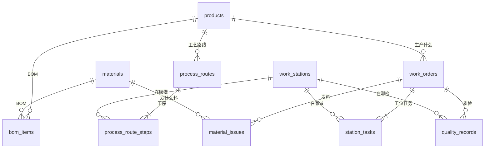

# SanyMES 数据模型说明

> 面向不熟悉 MES 业务的开发者，说明 `backend/app/models.py` 中每张表的**业务含义**、**字段含义**和**表间关系**。  
> 数据库文件：`backend/sanymes.db`（SQLite，启动后自动生成）。

---

## 目录

1. [MES 业务一句话](#1-mes-业务一句话)
2. [核心业务流程](#2-核心业务流程)
3. [表关系总图](#3-表关系总图)
4. [枚举值说明](#4-枚举值说明)
5. [表清单速查](#5-表清单速查)
6. [各表详细说明](#6-各表详细说明)
7. [Agent 开发时怎么用这些表](#7-agent-开发时怎么用这些表)

---

## 1. MES 业务一句话

**MES（Manufacturing Execution System，制造执行系统）** 管的是**车间里正在发生什么**：

- 今天要生产什么产品、多少台？→ **工单**
- 经过哪些工位、按什么顺序做？→ **工艺路线 / 工位任务**
- 操作工具体怎么做、注意什么？→ **SOP**
- 需要什么零件、库房里有没有？→ **BOM / 物料**
- 做到哪一步了、谁在做？→ **工位任务状态**
- 质量合不合格？→ **质检记录**

本 Demo 模拟 **18 号工厂泵车总装线**，不对接真实 ERP/PLC，但表结构贴近真实 MES 思路。

---

## 2. 核心业务流程

```
【主数据】事先配置好
  产品 Product ──→ BOM（要哪些物料）
                └──→ 工艺路线 ProcessRoute（经过哪些工位、SOP 是什么）

【执行】接到订单后
  创建工单 WorkOrder
      ↓ 自动生成
  工位任务 StationTask（每道工序一条）
  物料需求 MaterialIssue（要发哪些料）
      ↓
  下达工单（released）
      ↓
  配送物料（扣库存）
      ↓
  终端机：工位任务 开工 → 报完工（按 sequence 顺序）
      ↓
  质检 QualityRecord
      ↓
  全部工序完成 → 工单 completed
```

---

## 3. 表关系总图



### 分层理解

```
┌─────────────────────────────────────────────────────────┐
│  主数据层（产品、物料、工位、工艺模板）                      │
│  products · materials · bom_items · work_stations       │
│  process_routes · process_route_steps                   │
└───────────────────────────┬─────────────────────────────┘
                            │ 创建工单时「复制/生成」
                            ▼
┌─────────────────────────────────────────────────────────┐
│  执行层（一张具体订单的生命周期）                          │
│  work_orders · station_tasks · material_issues          │
│  quality_records                                        │
└─────────────────────────────────────────────────────────┘
```

**关键区别：**

| 模板（主数据） | 实例（执行） |
|---------------|-------------|
| `process_route_steps.sop_content` | `station_tasks.sop_content`（复制到工单） |
| 工艺路线定义「应该怎么生产」 | 工位任务记录「这张单实际做到哪了」 |

---

## 4. 枚举值说明

### WorkOrderStatus（工单状态）

| 值 | 中文 | 含义 |
|----|------|------|
| `pending` | 待下达 | 已创建，尚未正式投入产线 |
| `released` | 已下达 | 已批准生产，可配送物料 |
| `in_progress` | 生产中 | 至少一道工序已开工 |
| `completed` | 已完工 | 全部工序完成 |
| `closed` | 已关闭 | 归档（Demo 中较少用到） |

### StationTaskStatus（工位任务状态）

| 值 | 中文 | 含义 |
|----|------|------|
| `waiting` | 待开工 | 等上一道工序完成 |
| `in_progress` | 进行中 | 操作工已开工 |
| `completed` | 已完工 | 本道工序报工完成 |
| `blocked` | 异常 | 卡住（Demo 中较少用到） |

### QualityResult（质检结果）

| 值 | 中文 | 含义 |
|----|------|------|
| `pending` | 待检 | 尚未判定 |
| `pass` | 合格 | 通过 |
| `fail` | 不合格 | 未通过 |

### MaterialIssue.status（发料状态，字符串）

| 值 | 含义 |
|----|------|
| `pending` | 待配送 |
| `delivered` | 已出库配送 |
| `shortage` | 库存不足 |

---

## 5. 表清单速查

| 表名 | 中文 | 层级 | 一句话 |
|------|------|------|--------|
| `products` | 产品 | 主数据 | 生产什么东西（如 52 米泵车） |
| `materials` | 物料 | 主数据 | 零件/原材料及库存 |
| `bom_items` | BOM 明细 | 主数据 | 一个产品需要哪些物料、各多少 |
| `work_stations` | 工位 | 主数据 | 产线上的物理工位 |
| `process_routes` | 工艺路线 | 主数据 | 某产品的生产路径版本 |
| `process_route_steps` | 工艺工序 | 主数据 | 路线中每一道工序（工位+SOP） |
| `work_orders` | 工单 | 执行 | 一张具体的生产订单 |
| `station_tasks` | 工位任务 | 执行 | 工单在某工位上的作业实例 |
| `material_issues` | 物料配送 | 执行 | 工单需要的物料发料记录 |
| `quality_records` | 质检记录 | 执行 | 某工单在某工位的检验结果 |

共 **10 张表**，无用户/权限表（Demo 简化）。

---

## 6. 各表详细说明

### 6.1 products（产品）

**含义：** 工厂生产的成品型号，是一切 BOM 和工艺路线的归属对象。

| 字段 | 类型 | 含义 |
|------|------|------|
| `id` | int | 主键 |
| `code` | string | 产品编码，如 `SY-5288THB` |
| `name` | string | 产品名称，如「52米混凝土泵车」 |
| `description` | text | 产品描述，可空 |
| `created_at` | datetime | 创建时间 |

**关联：** 一对多 → `bom_items`、`process_routes`、`work_orders`

**Demo 示例：** 52米泵车、62米泵车、拖式混凝土泵

---

### 6.2 materials（物料）

**含义：** 生产用的零部件或原材料，有库存数量。

| 字段 | 类型 | 含义 |
|------|------|------|
| `id` | int | 主键 |
| `code` | string | 物料编码，如 `M-CHASSIS-001` |
| `name` | string | 物料名称，如「底盘总成」 |
| `unit` | string | 计量单位，默认「件」 |
| `is_critical` | bool | 是否关重件（关键件，缺了不能生产） |
| `stock_qty` | float | 当前库存数量 |

**关联：** 一对多 → `bom_items`、`material_issues`

**Demo 示例：** 底盘总成、臂架总成、工程轮胎；关重件库存低会在 Dashboard 预警

---

### 6.3 bom_items（BOM 明细）

**含义：** **Bill of Materials**，定义「做一个产品需要哪些物料、各要多少」。

| 字段 | 类型 | 含义 |
|------|------|------|
| `id` | int | 主键 |
| `product_id` | FK → products | 哪个产品 |
| `material_id` | FK → materials | 哪种物料 |
| `quantity` | float | 单台产品需要的数量 |

**关联：** 多对一 → `products`、`materials`

**业务：** 创建工单时，按 `quantity × 工单数量` 生成 `material_issues`

---

### 6.4 work_stations（工位）

**含义：** 产线上的物理作业位置，操作工在这里干活。

| 字段 | 类型 | 含义 |
|------|------|------|
| `id` | int | 主键 |
| `code` | string | 工位编码，如 `WS-A04` |
| `name` | string | 工位名称，如「液压系统工位」 |
| `line` | string | 所属产线，如「总装线A」 |
| `description` | text | 工位说明，可空 |

**关联：** 一对多 → `process_route_steps`、`station_tasks`、`quality_records`

**Demo：** 7 个工位，从底盘预装到终检

---

### 6.5 process_routes（工艺路线）

**含义：** 某产品的**生产路径模板**（走哪些工位、什么顺序），可有版本。

| 字段 | 类型 | 含义 |
|------|------|------|
| `id` | int | 主键 |
| `product_id` | FK → products | 适用产品 |
| `version` | string | 路线版本号，如 `2.1` |
| `is_active` | bool | 是否当前启用（创建工单时用 active 的） |

**关联：** 一对多 → `process_route_steps`

---

### 6.6 process_route_steps（工艺工序）

**含义：** 工艺路线中的**一道工序**：在哪个工位、什么顺序、SOP 和安全要求是什么。

| 字段 | 类型 | 含义 |
|------|------|------|
| `id` | int | 主键 |
| `route_id` | FK → process_routes | 所属工艺路线 |
| `station_id` | FK → work_stations | 在哪个工位执行 |
| `sequence` | int | 工序顺序（1, 2, 3…，必须按序报工） |
| `sop_content` | text | **标准作业程序**（操作步骤文本） |
| `standard_time_min` | int | 标准工时（分钟） |
| `safety_notes` | text | 安全注意事项，可空 |

**关联：** 多对一 → `process_routes`、`work_stations`

**Agent RAG：** 阶段 3 的 SOP 检索**从这里加载**（模板 SOP，不是运行时任务）

---

### 6.7 work_orders（工单）

**含义：** 一张**具体的生产订单**——「为谁、生产多少台什么产品」。

| 字段 | 类型 | 含义 |
|------|------|------|
| `id` | int | 主键 |
| `order_no` | string | 工单号，如 `WO-20250706-001`（业务主键） |
| `product_id` | FK → products | 生产哪种产品 |
| `quantity` | int | 生产数量（台） |
| `status` | enum | 工单状态，见 [WorkOrderStatus](#workorderstatus工单状态) |
| `customer` | string | 客户名称，如「中建三局」，可空 |
| `priority` | int | 优先级 1～10，数字越小越优先 |
| `planned_start` | datetime | 计划开始时间，可空 |
| `planned_end` | datetime | 计划结束时间，可空 |
| `created_at` | datetime | 创建时间 |
| `released_at` | datetime | 下达时间，可空 |
| `completed_at` | datetime | 完工时间，可空 |

**关联：** 多对一 → `products`；一对多 → `station_tasks`、`material_issues`、`quality_records`

**Demo 示例：** `WO-20250706-001` 中建三局，52米泵车 1 台，生产中

---

### 6.8 station_tasks（工位任务）

**含义：** 某张工单在**某个工位上**的具体作业任务，是 MES 终端机（`/terminal`）操作的对象。

| 字段 | 类型 | 含义 |
|------|------|------|
| `id` | int | 主键 |
| `work_order_id` | FK → work_orders | 属于哪张工单 |
| `station_id` | FK → work_stations | 在哪个工位 |
| `sequence` | int | 工序顺序（与工艺路线一致） |
| `sop_content` | text | SOP（创建工单时从工艺路线复制） |
| `safety_notes` | text | 安全注意事项（复制），可空 |
| `status` | enum | 任务状态，见 [StationTaskStatus](#stationtaskstatus工位任务状态) |
| `operator` | string | 当前操作工姓名，可空 |
| `started_at` | datetime | 开工时间，可空 |
| `completed_at` | datetime | 报完工时间，可空 |
| `report_note` | text | 报工备注，可空 |

**关联：** 多对一 → `work_orders`、`work_stations`

**业务规则：**

- 上一道 `sequence - 1` 必须 `completed` 才能开工
- 全部任务 `completed` → 工单自动变 `completed`
- 终端机页面按工位筛选任务

---

### 6.9 material_issues（物料配送 / 发料）

**含义：** 某张工单需要领取的物料清单及配送状态（模拟 LES/WMS 发料）。

| 字段 | 类型 | 含义 |
|------|------|------|
| `id` | int | 主键 |
| `work_order_id` | FK → work_orders | 哪张工单 |
| `material_id` | FK → materials | 哪种物料 |
| `quantity` | float | 需要数量 |
| `issued_at` | datetime | 发料/记录时间 |
| `status` | string | `pending` / `delivered` / `shortage` |

**关联：** 多对一 → `work_orders`、`materials`

**业务：** 调用「配送物料」API 时扣减 `materials.stock_qty`

---

### 6.10 quality_records（质检记录）

**含义：** 某张工单在某工位的质量检验记录，用于追溯。

| 字段 | 类型 | 含义 |
|------|------|------|
| `id` | int | 主键 |
| `work_order_id` | FK → work_orders | 哪张工单 |
| `station_id` | FK → work_stations | 哪个工位检验 |
| `inspector` | string | 检验员姓名 |
| `check_item` | string | 检验项目，如「底盘水平度」 |
| `standard` | string | 检验标准，如「≤ 2mm」 |
| `result` | enum | 检验结果，见 [QualityResult](#qualityresult质检结果) |
| `remark` | text | 备注，可空 |
| `inspected_at` | datetime | 检验时间 |

**关联：** 多对一 → `work_orders`、`work_stations`

---

## 7. Agent 开发时怎么用这些表

| Agent 能力 | 主要涉及的表 | 本项目实现 |
|-----------|-------------|-----------|
| 查工单进度 | `work_orders` + `station_tasks` + `work_stations` | `get_work_order` / 阶段 1 `service.py` |
| 列工单列表 | `work_orders` | `list_work_orders` |
| 查 SOP / 安全 | `process_route_steps`（模板） | `search_sop` / RAG |
| 创建/下达工单（阶段 4） | `work_orders` + `station_tasks` + `material_issues` | 待做 |
| 质检查询 | `quality_records` | 待扩展工具 |

### 工单进度怎么算

```
progress = station_tasks 中 status=completed 的数量 / 总数
current_station = 第一个 status=in_progress 的工位，或第一个 waiting
```

见 `service.py` 的 `_order_summary()`。

---

## 附录：Demo 种子数据一览

| 实体 | 数量/示例 |
|------|----------|
| 产品 | 3（52米泵车、62米泵车、拖泵） |
| 工位 | 7（WS-A01～A07） |
| 工艺路线 | 1（52米泵车 active） |
| 工单 | 3（1 生产中、1 已下达、1 待下达） |
| 物料 | 8 种 |

详细数据见 `backend/app/seed.py`。

---

> 相关文档：[Agent 学习路线](./agent-learning-roadmap.md) · [RAG 说明](./agent-rag.md) · [README 业务流程](../README.md)
